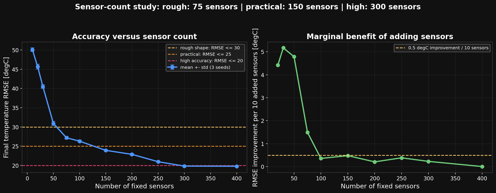
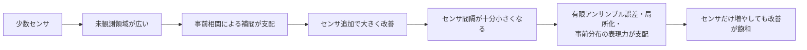

# 必要なセンサ数の検討

## 1. 目的

固定温度センサを何点配置すれば、ミッフィー温度場をどの程度復元できるかを
同じ確率的ESMDA設定で比較しました。

- グリッド：30 x 30 = 900セル
- センサ配置：真値を参照しない空間充填配置
- センサ数：10～400点
- 各センサ数を乱数シード3種類で実行
- 評価値：最終温度場のRMSE

生データは [`sensor_count_sweep.csv`](sensor_count_sweep.csv) に保存されます。

---

## 2. 結果

| センサ数 | 全セルに対する割合 | RMSE平均 [degC] | 標準偏差 [degC] | 判定 |
|---:|---:|---:|---:|---|
| 10 | 1.1% | 50.09 | 0.47 | 情報不足 |
| 20 | 2.2% | 45.67 | 0.64 | 情報不足 |
| 30 | 3.3% | 40.50 | 0.50 | 局所的な高温域のみ |
| 50 | 5.6% | 30.92 | 0.53 | 概形が現れ始める |
| 75 | 8.3% | 27.19 | 0.34 | 大まかな形状を復元 |
| 100 | 11.1% | 26.30 | 0.33 | 75点からの改善は小さい |
| 150 | 16.7% | 23.91 | 0.10 | 実用上のバランス候補 |
| 200 | 22.2% | 22.87 | 0.21 | 輪郭が改善 |
| 250 | 27.8% | 20.96 | 0.04 | 高精度側 |
| 300 | 33.3% | 19.82 | 0.02 | RMSE 20 degC未満 |
| 400 | 44.4% | 19.78 | 0.08 | 300点からほぼ改善なし |

---

## 3. 何点あればよいか

このケースでは、用途別の目安は次のとおりです。

| 目的 | 推奨センサ数 | 理由 |
|---|---:|---|
| 温度の高い場所を大まかに把握 | 75点以上 | RMSE 30 degC未満になる最小ケース |
| 形状と温度分布を実用的に復元 | 150点程度 | RMSE 25 degC未満で、追加効果も残る |
| できるだけ明瞭な形状を得る | 300点程度 | RMSE 20 degC未満になる |
| 300点よりさらに増やす | 現設定では非推奨 | 300→400点の改善が約0.04 degCしかない |

したがって、**費用対効果を優先するなら150点、精度を優先するなら300点**
が本シミュレーションでの結論です。

---

## 4. なぜセンサを増やしても途中で飽和するのか

300点付近ではセンサ不足よりも、次の誤差が支配的になります。

1. `N_ENS=300` の有限アンサンブルから計算する共分散誤差
2. ガウス平滑化した初期アンサンブルが鋭い境界を表現しにくい
3. 局所化半径 `R_LOC=5` による更新範囲の制約
4. 温度場を静的に補間しており、熱伝導の時間発展を使っていない

このため、400点へ増やすよりも、アンサンブル数、相関モデル、
物理モデルを改善する方が効果的です。

---

## 5. 注意事項

ここでの75、150、300点は普遍的な値ではありません。
次の条件が変われば必要数も変わります。

- グリッド解像度
- センサ配置
- 観測ノイズ
- 温度境界の細かさ
- 初期アンサンブルの空間相関
- 許容するRMSE

特に本ケースは、センサを格子全体へ均等配置しています。
実際の装置で設置不能領域がある場合や、境界付近へ重点配置する場合は
同じセンサ数でも結果が変わります。

