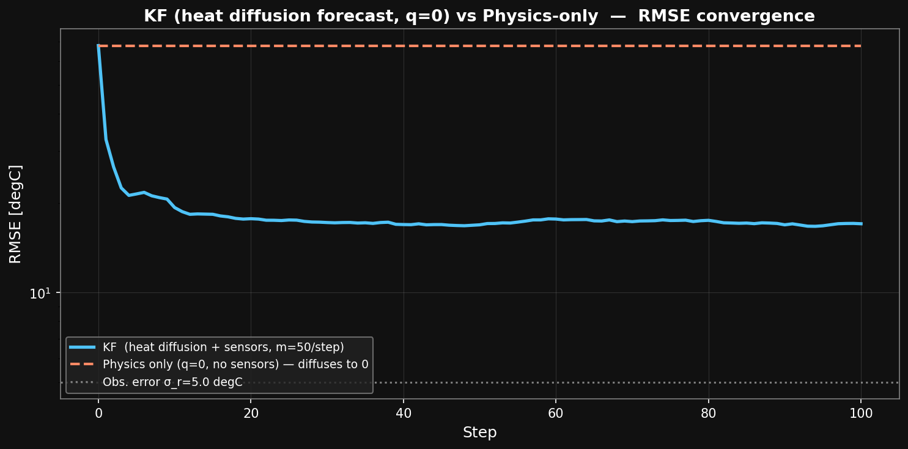
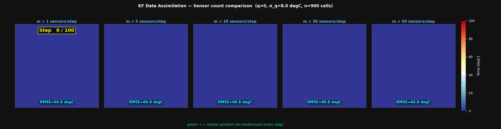
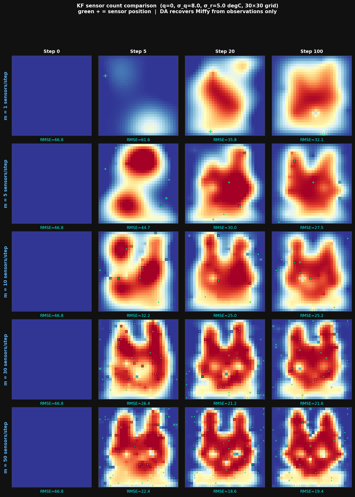
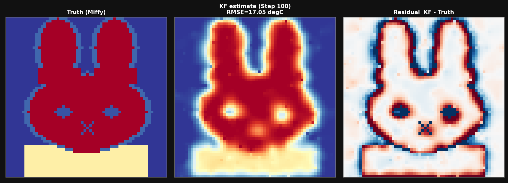
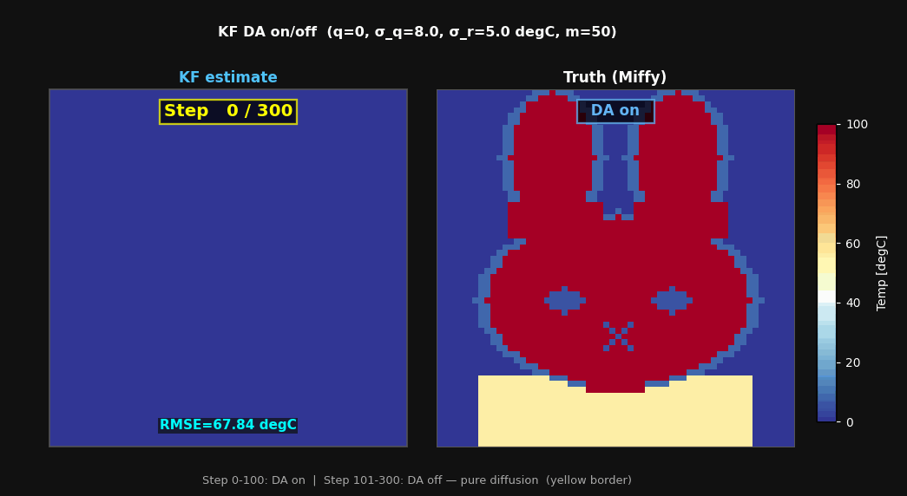
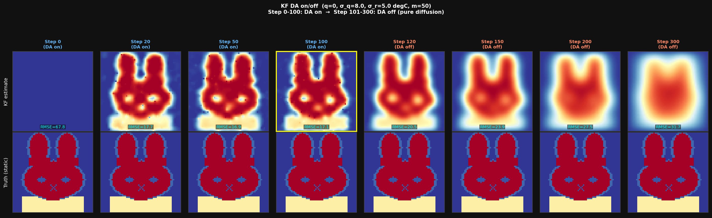

# カルマンフィルタ（KF） — 熱伝導方程式で予測するデータ同化

## 目標：何が起きるのか


全格子 T = 0°C（完全な無知）からスタートして、スパースな温度センサーだけでミッフィーの温度場を復元します。

**物理モデル（熱拡散）はミッフィーを知らない。**  
モデルは「温度は拡散して均一になる」とだけ予測します（q = 0）。  
それでも観測データを繰り返し取り込むことで、温度場を推定します。

---

## 1. この手法は何が違うのか

| | OI | EnKF | KF（本デモ） |
|--|--|--|--|
| 予測ステップ | なし（M = I を暗黙に仮定） | なし（M = I を暗黙に仮定） | **熱伝導方程式 M ≠ I** |
| 誤差共分散 | 固定ガウス関数 B | アンサンブル近似（N=50） | **完全な P 行列を追跡** |
| 最適性 | 近似 | 近似 | **数学的に最適（MVUE）** |
| 計算量 | O(nm) /cycle | O(Nm) /cycle | O(n²m) /step |
| RMSE（100 ステップ後） | 18.7°C | 17.6°C | **17.1°C** |

> MVUE = Minimum Variance Unbiased Estimator（最小分散不偏推定量）

**注目:** q=0（モデルが x_ss を知らない）設定では、KF の最終 RMSE は OI・EnKF と同程度です。  
KF の物理モデル（熱拡散）は真の場（静的ミッフィー）の動態と合っていないため、  
モデル誤差 Q=σ_q²·I が必要となり、精度向上の余地が相殺されます。  
**KF が OI/EnKF を大きく上回るのは、真の場が物理モデルの通りに時間変化する場合です。**

---

## 1.1 KF 独自の強み（この設定で有効なもの）

OI・EnKF と KF はどちらも m = 30 センサー/ステップで同程度の最終 RMSE です。  
それでも KF に価値がある理由：

### P 行列の正確な追跡

**OI の K**（毎ステップ同じ形）:

$$K_{OI}[:,j] = \frac{\sigma_b^2 \exp(-d_j^2/2L^2)}{\sigma_b^2 + \sigma_r^2}$$

「全格子で同じ形のガウスブロブ」。既に正確に推定できている格子にも毎回同じゲインを送る。

**KF の K**（今の不確かさに応じて変化）:

$$K_{KF}[:,j] = \frac{P_{ij}^f}{P_{jj}^f + \sigma_r^2}$$

既に $P_{ii}^a \approx 0$（確定済み）な格子点には $K \approx 0$ が自動的に割り当て。  
まだ不確かな格子点に大きな K が集中する。

### DA なし（センサー 0 個）との比較が本質

| | step 0 | step 100 | step 300 |
|--|--|--|--|
| KF (m=50) | 67.8°C | **17.1°C** | — |
| 物理のみ (q=0, センサーなし) | 67.8°C | **67.8°C** | **67.8°C** |

物理のみ（q=0）は x=0 が固定点のため RMSE が永久に変わらない。  
DA があって初めて x_ss に近づける。

---

## 2. 問題設定

### 真の温度場

```
ミッフィー定常温度場（静的）
T_FUR = 100°C, T_DRESS = 55°C, T_BG = 0°C
DA アルゴリズムには直接見せない — センサーを通じてのみ間接観測
```

### 初期推定値

```
全格子 T = 0°C（完全な無知）
```

### センサー

```
毎ステップ m=30 点をランダムに選択（再配置）
観測値 y_j = T_true(obs_j) + ε_j,  ε_j ～ N(0, σ_r²),  σ_r = 5°C
```

センサーは**毎ステップ独立にランダムで再配置**されます。

### 物理モデル

```
予測: x^f = M · x^a         (q=0: モデルは熱源を持たない)
P 更新: P^f = M P M^T + Q   (Q = σ_q²·I: モデル誤差)
```

**q = 0** が重要: モデルは x_ss の構造を一切知らない。  
DA は純粋に「スパース観測から温度場を推定する」という本来の役割を担う。

---

## 3. 熱伝導方程式の離散化

2D 熱伝導方程式（デカルト座標, Δx = 1 cell）:

$$\frac{\partial T}{\partial t} = \alpha \nabla^2 T$$

陽解法（Euler forward）で 1 ステップ離散化:

$$T^{n+1} = T^n + \Delta t \cdot \alpha \cdot L \cdot T^n$$

$$\boxed{M = I + \Delta t \cdot \alpha \cdot L}$$

| 記号 | 意味 | 本デモの値 |
|------|------|-----------|
| $L$ | 2D ラプラシアン行列（5 点差分） | 3600×3600 疎行列 |
| $\alpha$ | 熱拡散率 | 0.5 cells²/step |
| $\Delta t$ | 時間刻み | 0.2 step |
| $\Delta t \cdot \alpha$ | 安定性パラメータ | **0.1 ≤ 0.125 ✓** |

#### 安定性チェック

2D 陽解法の安定条件: $\Delta t \cdot \alpha \leq \frac{\Delta x^2}{8} = 0.125$

$\Delta t \cdot \alpha = 0.1 < 0.125$ → **全固有値が正（振動なし）**

#### なぜ q=0 でも DA が成立するか

$\mathbf{M}$ の固有値はすべて $\lambda \in [0.2,\,1)$ なので、$\mathbf{x}(t) \to \mathbf{0}$（温度が拡散して消える）。  
モデルは "答え（x_ss）" を知らないどころか、積極的にゼロへ引っ張る。

このずれを表すモデル誤差 $\mathbf{Q} = \sigma_q^2 \mathbf{I}$（$\sigma_q = 8°C$）をPに加えることで、  
カルマンゲインが適切に維持され、観測が継続的に効く。

---

## 4. カルマンフィルタのアルゴリズム

```
┌──────────────────────────────────────────────────────────────┐
│  初期化                                                        │
│    x_est = 0 (n×1)         ← 全格子を 0°C と推定            │
│    P = σ_b² exp(-d²/2L²)  ← ガウス誤差共分散 (n×n)          │
└──────────────┬───────────────────────────────────────────────┘
               │  毎ステップ繰り返す
               ▼
┌──────────────────────────────────────────────────────────────┐
│  ① 予測ステップ（熱拡散で 1 ステップ先を予測）               │
│    x^f = M · x^a                (q=0: 熱源なし)               │
│    P^f = M · P^a · M^T + σ_q²·I  (モデル誤差 Q を加算)       │
└──────────────┬───────────────────────────────────────────────┘
               ▼
┌──────────────────────────────────────────────────────────────┐
│  ② センサー観測                                               │
│    obs_idx: n=3600 格子から m=30 点をランダムに選択           │
│    y = x_true[obs_idx] + ε  (ε ～ N(0, σ_r²))               │
└──────────────┬───────────────────────────────────────────────┘
               ▼
┌──────────────────────────────────────────────────────────────┐
│  ③ 解析ステップ（センサーで予測を補正）                        │
│    K = P^f H^T (H P^f H^T + R)^{-1}   カルマンゲイン (n,m)  │
│    x^a = x^f + K (y - H x^f)           解析値 (n,)           │
│    P^a = P^f - K H P^f                 更新済み共分散 (n,n)  │
└──────────────────────────────────────────────────────────────┘
```

**Python コードとの対応:**

```python
# ① 予測ステップ
x_f = M_sp @ x_kf                    # 熱拡散で 1 ステップ予測（q=0）
MP  = M_sp.dot(P)                    # 疎×密 O(nnz·n)
P_f = (M_sp.dot(MP.T)).T            # P^f = M P M^T
np.fill_diagonal(P_f, P_f.diagonal() + SIGMA_Q**2)  # + σ_q²·I

# ② センサー観測
obs_idx = np.sort(rng.choice(n, M_OBS, replace=False))
y = x_ss[obs_idx] + rng.normal(0.0, SIGMA_R, M_OBS)

# ③ 解析ステップ
PHt  = P_f[:, obs_idx]                    # P H^T, (n,m)
HPHt = P_f[np.ix_(obs_idx, obs_idx)]      # H P H^T, (m,m)
S    = HPHt + SIGMA_R**2 * np.eye(M_OBS)  # イノベーション共分散
K     = PHt @ np.linalg.inv(S)            # カルマンゲイン (n,m)
innov = y - x_f[obs_idx]                 # イノベーション
x_kf  = x_f + K @ innov                  # 解析値
P     = P_f - P_f[obs_idx, :].T @ K.T    # P^a
```

---

## 5. なぜミッフィーを復元できるのか

### 5.1 カルマンフィルタは最良線形不偏推定量（MVUE）

**ガウス・マルコフ定理**：

> 線形モデル + ガウスノイズ + 完全な共分散行列 P のもとで、  
> カルマンフィルタは「すべての不偏線形推定量の中で最小分散を持つ」推定量です。

つまり「この種の問題で数学的に達成可能な最高精度」を実現しています。

### 5.2 P 行列がセンサー情報を空間に伝播する

カルマンゲインの 1 列（= センサー $j$ への応答）:

$$\mathbf{K}[:,j] = \frac{\mathbf{P}^f[:,j]}{P^f_{jj} + \sigma_r^2}$$

分子 $\mathbf{P}^f[:,j]$（$\in \mathbb{R}^n$）は「格子点 $i$ とセンサー $j$ の共分散」。  
初期ガウス P（相関長 $L_c = 5$ cells）では：

$$P_{ij} = \sigma_b^2 \exp\!\left(-\frac{d(i,j)^2}{2 L_c^2}\right)$$

センサー $j$ の周囲 $\sim \pi L_c^2 \approx 78$ 格子で $K[:,j]$ が非ゼロ → **1 回の観測で 78 格子が更新**。

### 5.3 P^f = M P M^T + Q の役割

```
Q = σ_q²·I を加えることで:
  - P^f が 0 に収縮するのを防ぐ（P → 0 だと K → 0 でセンサーが効かなくなる）
  - 毎ステップ「モデルが信頼できない分だけ不確かさを上乗せ」する
  - モデル (M) が積極的に 0 へ引っ張っても、観測が継続的に補正できる
```

---

## 6. 各ステップで何が起きているか

### Step 0（初期状態）

```
x_est = 0°C（全格子）
P_ii  ≈ 900°C²（σ_b = 30°C のガウス共分散）
RMSE  = 67.8°C  ← ミッフィーの平均温度との差
```

### Step 1

```
x^f = M·0 = 0  （q=0 なので予測は 0°C のまま）

センサー 30 点で観測。K @ innov により格子の 65% が直接補正される。

KF RMSE = 32.8°C  ← 1 ステップで 35°C 改善
物理のみ  = 67.8°C  ← 変化なし（x=0 は固定点）
```

### Step 5

```
KF RMSE = 21.5°C  ← 物理のみ（67.8°C）と大きな差が生まれる
```

### Step 10

```
KF RMSE = 19.3°C
```

### Step 100（最終）

```
KF RMSE = 17.1°C
物理のみ RMSE = 67.8°C  ← 変化なし（x=0 固定点のまま）
```

q=0 のため、KF も高周波成分の誤差が毎ステップ生じる（モデルが 0 に引く）が、  
観測が補正し続けることで ~18°C の RMSE 水準で安定する。

---

## 7. RMSE 収束比較



| 手法 | 初期 RMSE | 最終 RMSE | 注 |
|------|-----------|-----------|-----|
| KF（本デモ, q=0, m=50） | 67.8°C | **17.1°C** | 物理なしより 50°C 改善 |
| EnKF | 44.6°C | 17.6°C | 50 cycles |
| OI | 56.5°C | 18.7°C | 50 cycles |
| 物理モデルのみ (q=0) | 67.8°C | **67.8°C** | x=0 は固定点: 変化なし |

KF・OI・EnKF は同程度の RMSE に収束する。  
KF の利点は RMSE の数値ではなく、**P 行列の正確な追跡**（不確かさの空間構造を保持）にある。

---

## 8. OI・EnKF との詳細比較

### 8.1 K の計算方法

#### OI の K

$$K_{OI} = B H^T (H B H^T + R)^{-1}, \quad B_{ij} = \sigma_b^2 \exp\!\left(-\frac{d_{ij}^2}{2L^2}\right)$$

- B = 固定ガウス（毎サイクル同じ形）
- B が実際の誤差構造を反映していない → 近似的

#### KF の K

$$K_{KF} = P^f H^T (H P^f H^T + R)^{-1}$$

- P^f は前ステップの P^a から物理的に更新（+ モデル誤差 Q）
- 観測のたびに P が縮む → K が「今の不確かさ」を正確に反映

### 8.2 計算コスト

| | OI | EnKF | KF |
|--|--|--|--|
| メモリ | O(nm) | O(Nn) | O(n²) |
| メモリ量（n=3600） | 0.86 MB | 1.4 MB | **103 MB** |
| 1 ステップの計算 | O(nm²) | O(Nm²) | **O(n²m)** |
| 実行時間（本デモ） | ~1 秒 | ~5 秒 | ~160 秒 |

大規模問題（n >> 3600）では KF は実用的でなく、EnKF が使われる理由がここにある。

### 8.3 どの手法を使うべきか

| 状況 | 推奨手法 |
|------|---------|
| n が小さい（< 10000）、時間変化する場 | **KF** |
| n が大きい（> 10000）、物理モデルあり | **EnKF** |
| 物理モデルがない、静的な場の推定 | **OI** |
| リアルタイム処理が必要 | OI or EnKF |
| 数値気象予報、海洋 DA | EnKF or 4D-Var |

---

## 9. P^f = M P M^T + Q の計算方法

P は 3600×3600 = 103 MB の密行列。M は疎行列（5 対角, 18000 非ゼロ要素）。

ナイーブな計算 $M \cdot P \cdot M^T$ は O(n³) → 47 億回演算 → 遅すぎる。

**疎行列を使った効率的な計算:**

$$P^f = M P M^T + \sigma_q^2 I$$

M が対称（$M = M^T$）なことを利用:

```python
MP  = M_sp.dot(P)         # 疎×密 → 密,  O(nnz × n) = O(5n²)
P_f = (M_sp.dot(MP.T)).T  # 疎×密 → 密,  O(5n²)
np.fill_diagonal(P_f, P_f.diagonal() + SIGMA_Q**2)  # O(n): Q 加算
# 合計: O(10n²) ≈ 130M 演算
```

---

## 10. よくある疑問

### Q1: なぜ物理モデルだけでは収束しないのか？（q=0 の場合）

物理モデルのみ（センサーなし、q=0）では:

$$\mathbf{x}_{phys}(t) = \mathbf{M}^t \mathbf{x}_0$$

$\mathbf{x}_0 = \mathbf{0}$ なら $\mathbf{M}^t \cdot \mathbf{0} = \mathbf{0}$ → 永遠に 0°C のまま（RMSE = 67.8°C が変わらない）。  
DA があって初めて x_ss に近づける。

---

### Q2: KF は全ての問題で OI/EnKF より優れているか？

いいえ。KF が OI/EnKF より大きく勝るのは：

1. **真の場が物理モデルの通りに時間変化する**（例: 移動する熱源の追跡）
2. **線形モデル** M（非線形なら EKF や UKF が必要）
3. **ガウスノイズ**（非ガウスなら粒子フィルタが必要）

本デモは静的な真の場（ミッフィー）に対して拡散モデルを使うため、  
KF の物理モデルは「助け」ではなく「邪魔」になることもある。  
Q = σ_q²·I がその邪魔を抑制している。

---

### Q3: EnKF との関係は？

EnKF は「P 行列をアンサンブルで近似した KF」です。

$$P^f_{KF} = M P^a M^T + Q \quad \text{（3600×3600 の密行列を正確に計算）}$$

$$P^f_{EnKF} \approx \frac{1}{N-1} X' X'^T \quad \text{（N=50 のサンプルで近似）}$$

N → ∞ なら EnKF → KF。現実の気象や海洋では n が数千万〜数億なので、  
KF は実用不可能。EnKF + ローカライゼーションが事実上の標準手法。

---

### Q4: この問題で RMSE が ~18°C で止まる理由は？

各ステップで：
- モデル（M）が推定値を 0 方向に引き寄せる（モデル誤差の発生源）
- 観測（m=30）が観測点付近を x_ss 方向に補正する

この「引き」と「補正」の均衡が ~18°C の RMSE に対応する。  
センサーを増やす（m=100 など）か、より物理的に正しいモデルを使えば RMSE が改善する。

---

### Q5: センサー数の影響

30×30 グリッド（n=900）、q=0、Q=σ_q²·I での比較：

| センサー数 m | RMSE @ Step 100 |
|------------|----------------|
| m=1 | 32.1°C |
| m=5 | 27.5°C |
| m=10 | 25.2°C |
| m=30 | 21.6°C |
| m=50 | 19.4°C |

センサーが増えるほど改善するが、大きな差はない。  
この設定では、モデルの拡散（q=0）がボトルネックになっており、  
センサーを増やしても拡散に勝てない均衡が早めに訪れる。

詳細アニメーション → `anim_kf_sensor_count.gif`

---

## 11. なぜミッフィーの境目を見極められるのか

センサー補正が蓄積されると境界が形成される：

```
境界付近のセンサー配置（模式図）:

  ○──○──●──○──○
  ●──●──●──○──○  ● = 毛（100°C）付近のセンサー
  ×──×──×──×──○  × = 背景（0°C）付近のセンサー
```

- センサー ●（観測値 ≈ 100°C）: 正の補正ブロブ
- センサー ×（観測値 ≈ 0°C）: 負の補正ブロブ
- 境界付近: 正と負が打ち消し合い → 急激な温度変化

境界の鋭さは「相関長 L_CORR = 5 cells」で決まる。

---

## 12. センサー数の影響（アニメーション）



4 パネル（m=1, 5, 10, 30）の 100 ステップ推移。緑 `+` がセンサー位置（毎ステップ再配置）。

静止画比較:



実行スクリプト: `python/kf_sensor_count.py`（30×30 グリッド、q=0、Q=σ_q²·I）

---

## 13. 最終比較



Step 100 後の結果:

- **正解場**（ミッフィー）: アルゴリズムには一度も全体を見せていない
- **KF 推定**: RMSE = 17.1°C ← DA なし（67.8°C）から大幅改善
- **残差 KF - 正解**: 主に ±20°C 以内

---

## 14. データ同化の段階

```
A02_miffy_oi_T   : OI（解析のみ, 物理なし, B 固定）
A02_miffy_enkf_T : EnKF（解析のみ, 物理なし, B をアンサンブルで推定）
A002_miffy_kf_T  : KF（予測あり, 物理あり, P を正確に追跡）  ← ここ
（将来）A003     : OpenFOAM 連成 EnKF（実際の CFD コードが物理モデル）
```

本デモは「教科書の KF」を実装したものです。  
実際の工業応用では n が大きすぎるため、EnKF や 4D-Var が使われます。

---

## 15. DA 停止実験

KF が収束（step 100, RMSE ≈ 18.5°C）した後、センサーを切って物理のみで走らせるとどうなるか。

### 実験設定

| フェーズ | ステップ | 内容 |
|---------|---------|------|
| Phase 1 | 0 → 100 | KF（センサー 30 点/step + 熱拡散予測, q=0） |
| Phase 2 | 101 → 300 | **DA off**（センサーなし。熱拡散のみ: $\mathbf{x}^f = \mathbf{M}\mathbf{x}$） |

### 数値結果

| フェーズ | step 0 | step 100 | step 300 |
|---------|--------|---------|---------|
| KF DA on | 67.8°C | **17.1°C** | — |
| DA off（KF スタート） | — | 17.1°C | **31.7°C** ← 悪化 |

### なぜ DA を切るとミッフィーが消えていくのか

DA off 後、$\mathbf{x}(t)$ は $\mathbf{M}$ のみで更新される:

$$\mathbf{x}(t+1) = \mathbf{M}\,\mathbf{x}(t), \quad \mathbf{M} = \mathbf{I} + \Delta t\,\alpha\,\mathbf{L}$$

$\mathbf{M}$ の固有値 $\lambda < 1$ なので $\mathbf{x}(t) \to \mathbf{0}$（均一になる）。  
ミッフィーの構造が持っていた非ゼロ部分が拡散して消える。

**DA が継続的に必要な理由**: 観測がなければ、モデルは全温度を 0 に引き戻す。  
センサーが「ミッフィーの記憶」を維持している。





実行スクリプト: `python/kf_da_off.py`

---

## 16. 実行方法

```bash
cd A002_miffy_kf_T/python

# メインデモ（KF 収束, RMSE 曲線, GIF）
python3 kf_miffy.py
# → img/ に fig01〜04, anim_kf_miffy.gif を出力
# → 実行時間約 2〜3 分（n=3600, N_STEPS=100）

# センサー数比較（30×30 グリッドで高速）
python3 kf_sensor_count.py
# → fig10_sensor_count.png, anim_kf_sensor_count.gif

# DA 停止実験
python3 kf_da_off.py
# → fig11_da_off.png, anim_kf_da_off.gif
```

出力ファイル:

| ファイル | 内容 | 生成スクリプト |
|---------|------|--------------|
| `fig01_kf_snapshots.png` | スナップショット（KF / 物理のみ / 不確かさ） | kf_miffy.py |
| `fig02_kf_rmse.png` | RMSE 収束曲線 | kf_miffy.py |
| `fig03_kf_pdiag.png` | P 対角（不確かさマップ）の推移 | kf_miffy.py |
| `fig04_kf_final.png` | 最終推定値・正解・残差の比較 | kf_miffy.py |
| `anim_kf_miffy.gif` | KF 推定の推移（5 ステップ刻り） | kf_miffy.py |
| `fig10_sensor_count.png` | センサー数 m=1/5/10/30 比較 | kf_sensor_count.py |
| `anim_kf_sensor_count.gif` | センサー数比較アニメーション | kf_sensor_count.py |
| `fig11_da_off.png` | DA 停止後の推移 | kf_da_off.py |
| `anim_kf_da_off.gif` | DA on → off アニメーション | kf_da_off.py |
