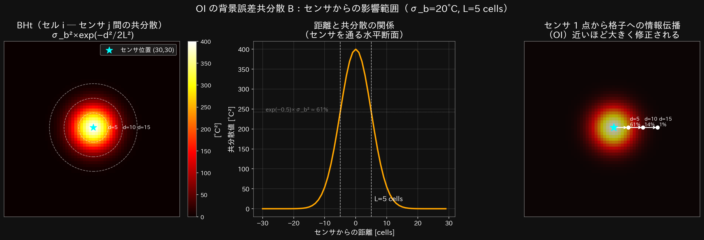
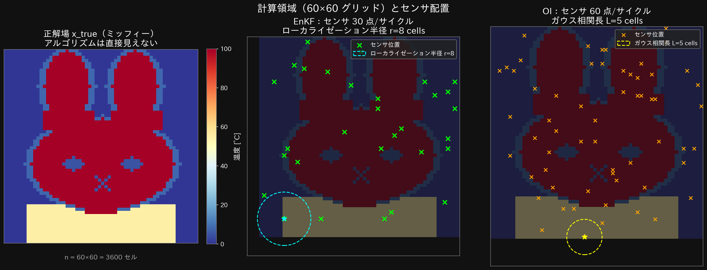
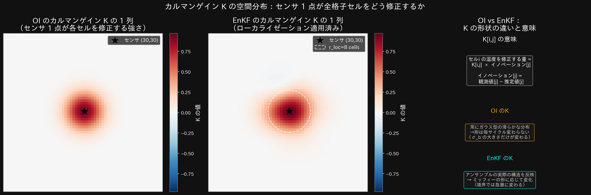
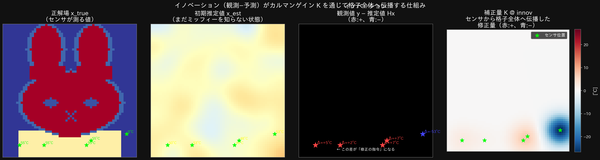
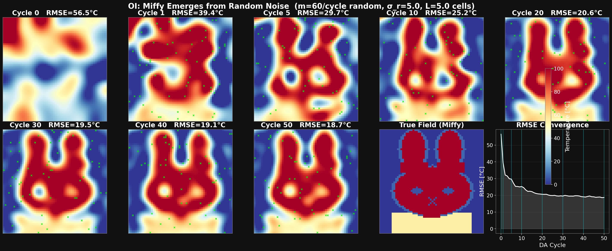
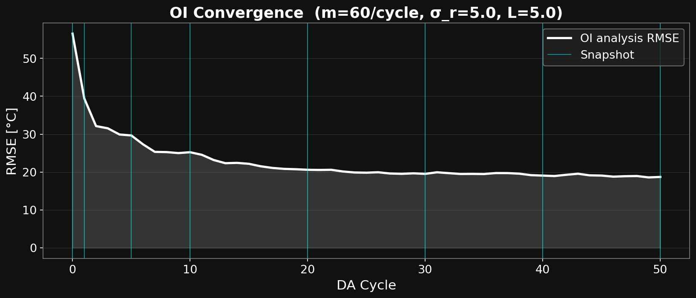

# 最適内挿法（OI）によるデータ同化

> **対象読者：** 「データ同化ってなに？」から入る方。Python の基礎的な読み書きができれば十分です。  
> **コード：** `python/oi_miffy.py`

---

## 1. まずゴールを見てみよう


- **左：** OI が推定している温度場（最初はランダムなノイズ）
- **右：** 正解のミッフィー温度場（アルゴリズムには直接見せない）
- **緑の×：** センサー位置（1サイクルに 60 点、全 3600 格子点の 1.7%）

サイクルが進むにつれて、**ノイズだらけだった左の画像がミッフィーの形に収束**していく。
これが OI（Optimal Interpolation：最適内挿法）の仕事です。

---

## 2. そもそも「なぜデータ同化が必要なのか」

### 温度分布はシミュレーションだけでは正確に求められない

熱変形解析や熱応力評価において、正確な温度分布を得るには
シミュレーションに入力する**以下の 3 つが正確にわかっている必要があります**：

```
正確な温度分布を得るための必要条件：

  ① 初期温度分布    ← 実機では場所ごとに異なり、正確には不明
  ② 熱伝達率       ← 材料・表面状態・流れ条件に依存し、ばらつきがある
  ③ 熱源の分布     ← 発熱源の位置・強度が設計値と実際で異なることが多い
```

現実の機械・構造物では、これら 3 つのうち少なくとも 1 つは**正確にはわからない**ことがほとんどです。  
その結果、シミュレーションによる温度分布は「近似的な傾向」にとどまります。

---

### 「傾向が合っていれば十分」では済まない理由

「多少ずれていても傾向さえ合えばいい」という考え方があります。  
しかし熱変形・熱変位の評価では、**わずかな温度分布の違いが変形量・変形パターンを大きく変えてしまいます**。

```
例：工作機械の主軸まわりの熱変位

  シミュレーション（熱源の分布が設計値）：
    主軸根元 62°C、先端 58°C → 先端が軸方向に +120 μm 伸びる（予測）

  実際（ベアリング発熱が予測より偏っていた）：
    主軸根元 65°C、先端 54°C → 先端が軸方向に +80 μm しか伸びない（実測）

  差はわずか数°C だが、変位量に 40 μm の誤差 → 加工精度に直結
```

このように、**温度分布の「傾向」ではなく「精度」が重要**な場面では、
シミュレーション単体では限界があります。

---

### センサーデータを使って精度を補う

一方で、実機には温度センサー（熱電対・赤外線カメラ等）が取り付けられていることが多く、
いくつかの計測点では実際の温度がわかっています。

```
手元にあるデータ：
  センサー位置での実測温度（数点〜数十点）← これは正確

知りたいこと：
  格子全体の温度分布（3600 点）← これが不明
```

この「**数点の正確な実測データ**」と「**格子全体をカバーするシミュレーション**」を
賢く組み合わせることができれば、単独では得られなかった精度の高い温度分布推定が可能になります。

> **これがデータ同化のモチベーションです。**  
> 本資料は、その手法（OI と EnKF）を理解するための学習用資料として作成しています。

---

### 「知りたい点」と「測れる点」の数が全く釣り合わないという課題

動機はわかった。しかし実際にやろうとすると、次の壁があります。

```
知りたい格子点の数：3600 点  (60×60 グリッド全体)
実際に測れるセンサー数：60 点  (コスト・取付スペースの制約)

測れる割合：60 ÷ 3600 = 1.7% だけ！
残りの 98.3% の格子点は温度が直接わからない
```

センサーを 3600 点すべてに取り付けることは、現実の機械ではコスト・スペース・
ケーブル配線の都合から不可能です。  
「測れる点は少ない。でも知りたい点は多い。」——この**圧倒的な情報不足**こそが
データ同化が解こうとしている問題の本質です。

### 問題の立て方

> センサーが置かれていない格子点の温度を、どうやって推定すればいいか？

一番シンプルなアイデアは「**近くのセンサーと似た値のはずだ**」です。  
OI はこのアイデアを、誤差統計を使って数学的に定式化したものです。

---

> **【注】OI は熱伝導方程式などの物理法則を使っていない**
>
> OI の B 行列（ガウス共分散）は「距離が近いほど相関が強い」という  
> **幾何学的・統計的な仮定**であり、熱伝導方程式は一切含みません。  
> 実際の温度分布は「距離」だけでなく、熱伝達率の分布・熱源の位置・  
> 境界条件によって決まります。OI はそれらを無視しているため、  
> 鋭いエッジや非等方的な熱伝導を正確に表現できないという限界があります。

---

### 物理法則を組み込む方法はあるか？

あります。主に 3 つのアプローチがあります。

**① B 行列に熱伝導方程式の解を使う（物理ベース B）**

熱伝導方程式のグリーン関数（点熱源に対する応答）を B 行列として使う方法です。
「距離が近い」ではなく「熱が伝わりやすい経路でつながっているほど相関が強い」という
物理的に正しい B を作れます。

```
ガウス B（OI）：              物理ベース B：
  B[i,j] = exp(-d²/2L²)        B[i,j] ∝ グリーン関数 G(i,j)
  距離だけで決まる              熱伝達率・境界条件を反映する
  壁をはさんでも相関する        壁で断熱なら相関ゼロ
```

実装は難しくなりますが、特に「熱的に孤立した領域が複数ある」場合に
ガウス B より大幅に精度が上がります。

**② EnKF に物理ソルバーを組み込む（本デモの次のステップ）**

現在の EnKF デモ（A02）はアンサンブルを観測で更新するだけで、
サイクル間に物理モデルを走らせていません（**解析ステップのみ**）。

本来の EnKF には**予測ステップ**があります：

```
【解析ステップのみ（現在の A02）】
  X_old ──[観測で更新]──→ X_new ──[観測で更新]──→ ...
  ↑ サイクル間に物理モデルなし

【予測ステップあり（A03 以降の目標）】
  X_old ──[観測で更新]──→ X_analysed
                               ↓ 各メンバーで laplacianFoam を実行
                           X_forecast ──[観測で更新]──→ ...
```

各メンバーで OpenFOAM（laplacianFoam）を走らせてから次の観測で更新することで、
**熱伝導方程式に沿った時間発展**をアンサンブルが自動的に学習します。
これが「CFD との連成 EnKF」であり、物理的に最も整合性の高い方法です。

**③ 4D-Var（4 次元変分法）**

物理モデルを陽に制約条件として組み込み、観測との残差を最小化する最適化手法です。

```
最小化する目的関数：
  J(x) = ||x - x_b||²_B⁻¹  +  ||y - Hx||²_R⁻¹
          ↑背景値からのずれ      ↑観測との残差

  + ∑ ||x(t+1) - M(x(t))||²  ← 物理モデル M（熱伝導）に沿う制約
```

精度は高いですが、「随伴モデル（adjoint）」の導出が必要で実装コストが高く、
非線形モデルへの適用が難しいという欠点があります。

---

**まとめ：本デモの位置づけ**

| 手法 | 物理法則 | 実装難度 | 本デモとの関係 |
|------|---------|---------|--------------|
| OI（本章）| なし（ガウス B）| 低 | A02 で実装済み |
| EnKF（次章）| なし（A02 の現状）| 中 | A02 で実装済み |
| EnKF + CFD | あり（laplacianFoam）| 高 | A03 以降の目標 |
| 物理ベース B | あり（グリーン関数）| 高 | 発展的な話題 |
| 4D-Var | あり（随伴モデル）| 非常に高 | 発展的な話題 |

本デモは「物理法則なし」の OI と EnKF を通じてデータ同化の基礎を学ぶことが目的です。
物理法則との連成は A03 以降で扱う予定です。

---

## 3. OI の核心アイデア：「近いほど似ている」をガウス関数で表す

### 空間相関とは

温度場には「**空間的な相関**」があります。

```
           センサー（100°C）
                ★
               ...
         ↑↑↑  ← ここも高温のはず（近いから）
        ↑   ↑
       ↑     ↑  ← 少し遠い。まあまあ高温
      ↑       ↑
     ↑         ↑  ← かなり遠い。ほぼ無関係
```

「近いセルは似た温度を持つ確率が高い」——これを式で表すのが **ガウス共分散関数**です：

$$B_{ij} = \sigma_b^2 \exp\!\left(-\frac{d(i,j)^2}{2L^2}\right)$$

| 記号 | 意味 |
|------|------|
| $d(i,j)$ | セル $i$ とセル $j$ の距離 [cells] |
| $L$ | 空間相関長（`L_CORR = 5.0 cells`）|
| $\sigma_b^2$ | 背景誤差の分散（推定値への信頼度）|

距離と相関の関係を表に整理すると：

| 距離 $d$ | 相関 $\exp(-d^2/2L^2)$（$L=5$）| 意味 |
|---------|--------------------------------|------|
| 0 cells | 1.00 | 同じセル → 100% 相関 |
| 5 cells | 0.61 | 1 相関長 → 61% 相関 |
| 10 cells | 0.14 | 2 相関長 → 14% 相関 |
| 15 cells | 0.01 | 3 相関長 → ほぼ無関係 |

つまり「**センサーから半径 $L$ 以内は強く修正、それ以上は無視**」という動作をします。

### B 行列の空間的な意味（可視化）



- **左：** グリッド中心にセンサー 1 点を置いたとき、B 行列（$BH^\top$）が空間上でどんな分布になるか
  - 中心が一番明るく（相関が強い）、遠ざかるほど暗くなる（相関が弱い）
  - これが「センサー 1 点の影響が届く範囲」の形
- **中：** 距離と共分散値の対応グラフ（$L=5$ のガウス曲線）
- **右：** 複数センサーが重なると、影響範囲が足し合わさる

> **直感：** センサー 1 点がある格子点に与える「修正の強さ」は、この釣り鐘型の図そのものです。

---

## 4. 問題設定

### センサー配置と計算領域



- **左：** 正解場（ミッフィー）。アルゴリズムはこれを直接見られない
- **中：** EnKF のセンサー配置（30 点 + ローカライゼーション半径）
- **右：** OI のセンサー配置（60 点 + ガウス相関長 $L=5$）← **OI はこちら**

### パラメータ

| パラメータ | コード変数 | 値 | 意味 |
|-----------|-----------|-----|------|
| 格子点数 | `n` | 3600 | 60 × 60 グリッド |
| センサー数 / サイクル | `M_OBS` | 60 | 毎サイクルランダムに配置 |
| 観測誤差標準偏差 | `SIGMA_R` | 5.0 °C | センサーの測定誤差 |
| 空間相関長 | `L_CORR` | 5.0 cells | ガウス型 B の広がり |
| 初期背景誤差 | `SIGMA_B0` | 30.0 °C | 最初はほぼ何も知らない |
| 背景誤差の下限 | `SIGMA_B_MIN` | 3.0 °C | これ以下には縮めない |
| 背景誤差の減衰率 | `DECAY` | 0.88 | 1 サイクルごとに 0.88 倍に縮小 |
| DA サイクル数 | `N_CYC` | 50 | 繰り返す回数 |

---

## 5. アルゴリズムの全体像

### 一言で言うと

> **「背景値（推定値）」と「観測値」を、誤差の大きさに応じた重みで合成する**

重みが **カルマンゲイン $K$** です。

### 全体フロー

```
━━━━━━━━━━━━━━━━━━━━━━━━━━━━━━━━━━━━━━━━━━━━━━━━━━━━━━━━━━━━
 【初期化】1 回だけ実行
━━━━━━━━━━━━━━━━━━━━━━━━━━━━━━━━━━━━━━━━━━━━━━━━━━━━━━━━━━━━

  x_true (3600,) = make_miffy()              ← 正解（見えない）
  x_est  (3600,) = 平均 50°C ± ランダムノイズ  ← 推定値（1 本だけ）

━━━━━━━━━━━━━━━━━━━━━━━━━━━━━━━━━━━━━━━━━━━━━━━━━━━━━━━━━━━━
 【DA サイクル × 50 回】
━━━━━━━━━━━━━━━━━━━━━━━━━━━━━━━━━━━━━━━━━━━━━━━━━━━━━━━━━━━━

  ┌─ STEP 1：背景誤差 σ_b を更新 ─────────────────────────────────┐
  │  sb = max(30.0 × 0.88^cyc, 3.0)                              │
  │  → 最初は大きく（何も知らない）、サイクルを経るほど小さく          │
  └────────────────────────────────────────────────────────────┘
        ↓
  ┌─ STEP 2：センサー配置・観測 ───────────────────────────────────┐
  │  obs_idx (60,) ← 3600 点からランダムに 60 点を選ぶ              │
  │  y (60,)      ← 正解値 + 観測誤差 N(0, 5²)                     │
  └────────────────────────────────────────────────────────────┘
        ↓
  ┌─ STEP 3：B 行列をガウス式で計算 ──────────────────────────────┐
  │  BHt   (3600×60) ← 全格子点とセンサー間の共分散               │
  │  HBHt  (60×60)   ← センサー間の共分散 + 観測誤差 R            │
  └────────────────────────────────────────────────────────────┘
        ↓
  ┌─ STEP 4：カルマンゲイン K を計算 ──────────────────────────────┐
  │  K (3600×60) = BHt @ inv(HBHt)                               │
  │  → 「センサーの修正をどう格子全体に配るか」の重み行列            │
  └────────────────────────────────────────────────────────────┘
        ↓
  ┌─ STEP 5：イノベーション計算 → 推定値を更新 ───────────────────┐
  │  innov (60,) = y - x_est[obs_idx]   ← 観測 − 予測             │
  │  x_est (3600,) = x_est + K @ innov  ← 全格子点を補正          │
  └────────────────────────────────────────────────────────────┘
        ↓ x_est を次サイクルへ渡す
```

---

## 6. STEP ごとの詳細解説

### STEP 1：背景誤差 $\sigma_b$ の減衰

「どれだけ自分の推定値を疑うか」を表す数値が $\sigma_b$ です。

$$\sigma_b^k = \max\!\left(\sigma_b^0 \times 0.88^k,\; \sigma_b^{\min}\right)$$

```python
sb = max(SIGMA_B0 * DECAY**cyc, SIGMA_B_MIN)
#         30.0   × 0.88^k    ,  3.0
```

| サイクル | $\sigma_b$ | 意味 |
|---------|-----------|------|
| 0 | 30.0 °C | 「まだ何も知らない」→ 観測を大きく信頼して急いで修正 |
| 5 | 15.8 °C | 少し収束してきた |
| 10 | 8.4 °C | だいぶ安定してきた |
| 20 | **3.0 °C（下限）** | ここで減衰が止まる |
| 50 | 3.0 °C | それ以降は小さな修正のみ |

> $\sigma_b$ が小さくなるほど B 行列の値も小さくなり → K も小さくなる → 更新量が小さくなる。  
> これは「サイクルを経るほど確信が増す」ことを手動で表現しています。  
> EnKF ではアンサンブルスプレッドが自動的に同じ役割を果たします。

---

### STEP 2：センサー配置と観測

センサーをランダムに 60 点選び、正解場に誤差を加えて「観測値」を作ります。

```python
obs_idx = np.sort(rng.choice(n, size=M_OBS, replace=False))  # 60点をランダム選択
obs_iy  = obs_idx // NX   # 各センサーの行番号
obs_ix  = obs_idx % NX    # 各センサーの列番号

y = x_true[obs_idx] + rng.normal(0.0, SIGMA_R, M_OBS)  # 正解 + 誤差
```

```
センサー obs_idx[0] がセル 500 に置かれた場合：
  y[0] = x_true[500] + ε
       = 100.0°C     + 3.2°C  ← 測定誤差 ε ~ N(0, 5²)
       = 103.2°C
```

センサーはサイクルごとに毎回ランダムに置き直されます。
これにより少ないサイクルでも格子全体をカバーできます。

---

### STEP 3：B 行列をガウス式で計算

OI の最大の特徴は、B 行列を「**数式で直接計算**」することです。

#### グリッド–センサー間共分散 $\mathbf{B}\mathbf{H}^\top$（shape: 3600 × 60）

$$[\mathbf{B}\mathbf{H}^\top]_{ij} = \sigma_b^2 \exp\!\left(-\frac{d(i,j)^2}{2L^2}\right)$$

```python
dy_all = iy_all[:, None] - obs_iy[None, :]   # y 方向距離 (3600, 60)
dx_all = ix_all[:, None] - obs_ix[None, :]   # x 方向距離 (3600, 60)
BHt = sb**2 * np.exp(-0.5 * (dy_all**2 + dx_all**2) / L_CORR**2)  # (3600, 60)
```

この行列の意味を図解すると：

```
BHt (3600 × 60 の行列)：
           センサー1  センサー2  ...  センサー60
  セル 0  [  近い→大  ,  遠い→小  , ... ,    ]
  セル 1  [     ...                           ]
  ...
  セル3599[  遠い→小  ,  近い→大  , ... ,    ]
```

センサーに**近いセル**の行 → 大きな値（修正を多く受け取る）  
センサーに**遠いセル**の行 → ほぼゼロ（修正をほとんど受け取らない）

#### センサー–センサー間共分散 $\mathbf{H}\mathbf{B}\mathbf{H}^\top$（shape: 60 × 60）

```python
dy_obs = obs_iy[:, None] - obs_iy[None, :]   # センサー間 y 距離 (60, 60)
dx_obs = obs_ix[:, None] - obs_ix[None, :]   # センサー間 x 距離 (60, 60)
HBHt = sb**2 * np.exp(-0.5 * (dy_obs**2 + dx_obs**2) / L_CORR**2)  # (60, 60)
HBHt += np.diag(np.full(M_OBS, SIGMA_R**2))  # + 観測誤差 R = σ_r²·I
```

最後の 1 行で観測誤差 $\mathbf{R}$ を**対角成分に加算**するのがポイントです。  
これにより「センサーの共分散 + センサー自身の誤差」という構造になります。

---

### STEP 4：カルマンゲイン $K$

$$\mathbf{K} = \mathbf{B}\mathbf{H}^\top \underbrace{(\mathbf{H}\mathbf{B}\mathbf{H}^\top + \mathbf{R})^{-1}}_{\text{60×60 の逆行列だけ！}}$$

```python
K = BHt @ np.linalg.inv(HBHt)
#   (3600,60) × (60,60) → K shape (3600, 60)
```

$K_{ij}$ の意味：「**センサー $j$ のイノベーションを、格子点 $i$ の修正量に変換する係数**」

- $K_{ij}$ が大きい → センサー $j$ はセル $i$ を大きく修正する
- $K_{ij}$ が小さい → センサー $j$ はセル $i$ にほぼ影響しない

#### K の「1 列」が何を意味するか

K は (3600 行 × 60 列) の行列です。  
**列 $j$ =「センサー $j$ が各セルに与える影響の空間マップ」** です。

```
K (3600 × 60 の行列)

           センサー0  センサー1  ...  センサー59
  セル  0  [ 0.01  ,  0.00  , ... ,  0.85  ]  ← センサー59 に近い
  セル  1  [ 0.02  ,  0.00  , ... ,  0.73  ]
  ...
  セル100  [ 0.97  ,  0.00  , ... ,  0.00  ]  ← センサー0 のすぐ近く
  ...
  セル3599 [ 0.00  ,  0.98  , ... ,  0.00  ]  ← センサー1 のすぐ近く

  ↑ 各列を 60×60 に reshape すると → センサー1点の「影響マップ」になる
```

#### センサー 1 点の影響がどう広がるか（数値で確認）

センサー 1 点だけの場合（$m=1$）、K は次の式に簡略化されます：

$$K_i = \frac{\sigma_b^2}{\sigma_b^2 + \sigma_r^2} \times \exp\!\left(-\frac{d_i^2}{2L^2}\right)$$

$\sigma_b = 30°C,\; \sigma_r = 5°C,\; L = 5$ cells のとき：

| センサーからの距離 $d$ | $K_i$ の値 | イノベーション = +40°C のときの補正量 |
|----------------------|-----------|--------------------------------------|
| 0 cells（センサー自身）| $\frac{900}{925} \approx 0.973$ | **+38.9°C** |
| 1 cell | $0.973 \times 0.980 \approx 0.954$ | +38.2°C |
| 5 cells（= $L$）| $0.973 \times 0.607 \approx 0.591$ | +23.6°C |
| 10 cells（= $2L$）| $0.973 \times 0.135 \approx 0.131$ | +5.2°C |
| 15 cells（= $3L$）| $0.973 \times 0.011 \approx 0.011$ | +0.4°C |
| 20 cells（= $4L$）| $0.973 \times 0.001 \approx 0.001$ | +0.03°C（ほぼ 0）|

センサー自身とほぼ同じ量（38.9°C）が修正されるのは距離 0 だけで、
距離 5（= $L$）では補正量が半分以下（23.6°C）になり、
距離 15（= $3L$）ではほぼゼロ（0.4°C）になります。

#### グリッド上での補正量の広がり（ASCII 図）

センサーがグリッド中央（★）に置かれ、イノベーション = +40°C のとき：

```
  ← 距離 →  0   1   2   3   4   5   6   7   8   9  10  11  12  13  14  15
補正量 [°C]: 38.9 38.2 35.9 32.2 27.6 23.6 19.6 16.0 12.5  9.5  5.2  2.7  1.4  0.7  0.5  0.4

グリッド上のイメージ（数字は補正量 [°C]、センサーの位置 = ★）：

     ...  0.4  1.4  3.5  7.0 13.5 23.6 35.9 ★38.9 35.9 23.6 13.5  7.0  3.5  1.4  0.4  ...
     
                              ここまでは大きい修正↗       ↘ここから急速に小さくなる
```

センサーがある 1 点で測った「+40°C ずれている」という情報が、
半径 $L=5$ cells の範囲を中心に周囲へ染み出していく様子がわかります。

#### カルマンゲインの空間分布（可視化）



- **左（OI）：** センサー（白の×）の中心から、上の表の通りガウス型に値が広がっている。
  明るい（大きい）→ センサーに近く大きく修正される。暗い（小さい）→ ほぼ修正されない。
  形はサイクルを通じて変わらない（B がガウス式で固定のため）
- **中（EnKF）：** アンサンブルが学習した実際の温度場の構造を反映した分布。
  ローカライゼーション半径（白破線）外はゼロに近い

#### 60 センサーが同時に更新するとき：`K @ innov`

実際には 60 センサーが同時にイノベーションを持ちます。
各セルへの補正量は **60 センサー全員の寄与を足し合わせた値**になります。

```python
x_est = x_est + K @ innov
#                ↑
#    K (3600×60) @ innov (60,)
#    = セル i への補正量
#      = K[i,0]×innov[0] + K[i,1]×innov[1] + ... + K[i,59]×innov[59]
#        ↑センサー0の寄与  ↑センサー1の寄与         ↑センサー59の寄与
```

セル $i$ への補正量 = 「近くのセンサーのイノベーション（大きな重み）」＋「遠くのセンサーのイノベーション（ほぼゼロ）」

```
例：セル i の近くにセンサー A（距離 3 cells）とセンサー B（距離 18 cells）がある場合

セル i への補正量
  = K[i, A] × innov[A]  +  K[i, B] × innov[B]
  ≈ 0.85    × (+30°C)   +  0.001   × (−20°C)
  ≈ +25.5°C              +  −0.02°C
  ≈ +25.5°C   ← センサー A の情報だけが実質的に届く
```

遠くのセンサー B のイノベーションが −20°C（つまり低温側の誤差）であっても、
K が極小なので影響はほぼゼロです。これが OI の「**局在化**」の仕組みです。

---

### STEP 5：イノベーションと分析更新

**核心の式：**

$$\mathbf{x}^a = \underbrace{\mathbf{x}^b}_{\text{更新前（背景値）}} + \mathbf{K}\underbrace{(\mathbf{y} - H\mathbf{x}^b)}_{\text{イノベーション}}$$

「**イノベーション**」＝観測値 − 予測値の差（＝センサーが教えてくれる誤差の量）

```python
innov = y - x_est[obs_idx]    # イノベーション  shape (60,)
#       ^   ^^^^^^^^^^^^^^^^
#       観測値  − 現在の推定値のセンサー位置の値

x_est = x_est + K @ innov     # 全格子点を更新  shape (3600,)
```

#### 具体例で理解する

```
センサーがセル 100 に置かれ、観測値 y = 90°C だったとする

現在の推定値 x_est[100] = 50°C  （まだ正解を知らない状態）

イノベーション = 90 - 50 = +40°C  ← 観測の方が 40°C 高い！

補正量 K @ innov：
  セル 100（センサーそのもの）      : 大きく +方向に修正（K が最大）
  セル 101（隣のセル、距離 d=1）   : 少し小さく +方向に修正
  セル 105（距離 d=5、1 相関長）   : 61% の強さで修正
  セル 200（距離 d≈14 cells）      : ほぼ修正されない（exp(-4)≈0）
```

#### イノベーションが格子全体に伝播する様子



左から順に：
1. **正解場（ミッフィー）** — アルゴリズムには見せない
2. **初期推定値** — ランダムノイズ（全体が 50°C 付近）
3. **各センサーのイノベーション** — センサー位置での観測値と予測値の差
4. **補正量が格子全体へ伝播** — `K @ innov` の結果（下記で詳述）

---

#### ④ の中身：`K @ innov` で何が起きているか

**`K @ innov` は行列とベクトルの積です：**

```
K (3600×60) @ innov (60,) = correction (3600,)

補正量[セル i] = K[i,0]×innov[0] + K[i,1]×innov[1] + ... + K[i,59]×innov[59]
```

これは「60 個のセンサーがそれぞれ作る補正ブロブを、全部重ね合わせる」操作です。

---

**STEP 1：各センサーが「補正ブロブ」を 1 つ作る**

センサー $j$ の補正ブロブ = `K[:, j] × innov[j]`

```
センサー j の位置 ★ に、イノベーション innov[j] = +50°C があった場合：

K[:, j] の空間分布         × innov[j]         = センサー j の補正ブロブ
（センサー j のフットプリント）

  0   0   0   0   0             +50°C              0    0    0    0    0
  0   3  12  25  12   0                            0  +1.5  +6  +12   +6   0
  0  12  39  59  39  12   0                        0   +6  +20  +30  +20   +6   0
  0  25  59 100  59  25   0    ×  0.01  →          0  +12  +30  +48  +30  +12   0
  0  12  39  59  39  12   0                        0   +6  +20  +30  +20   +6   0
  0   3  12  25  12   0                            0  +1.5  +6  +12   +6   0
  0   0   0   0   0             （×100の値を0-100に正規化）

 ★ にある 100 の値が、距離に応じてガウス型に減衰していく
 （数値はイメージ。実際は K[i,j] = σ_b²/(σ_b²+σ_r²) × exp(-d²/2L²)）
```

センサーがミッフィーの**顔（100°C）** にある場合：
- x_est ≈ 50°C なので innov ≈ +50°C（観測の方が高い）
- → その周辺に「**高温方向のブロブ**」が生まれる

センサーが**背景（0°C）** にある場合：
- x_est ≈ 50°C なので innov ≈ −50°C（観測の方が低い）
- → その周辺に「**低温方向のブロブ**」が生まれる

---

**STEP 2：60 個のブロブを全部足し合わせる**

```
correction = K[:,0]×innov[0] + K[:,1]×innov[1] + ... + K[:,59]×innov[59]
           =  ブロブ_0        +  ブロブ_1        + ... + ブロブ_59
```

グリッド上のイメージ（センサー配置例）：

```
正解場とセンサーのイノベーション                 60個のブロブを足し合わせた補正量マップ

  背景 0°C | 顔 100°C | 背景 0°C             低温ブロブ | 高温ブロブ | 低温ブロブ
           |          |                               |           |
      ×    |          |    ×                    (−)  |           |    (−)
     -50°C |          |  -50°C               ─────────   ─────────   ─────────
           |    ×     |                                |   (+)     |
           |  +50°C   |                               重なる領域は足される
           |          |                               ブロブ同士が隣接すると
                                                      境界が鋭くなる傾向がある
```

---

**STEP 3：足し合わせた補正量を x_est に加算する**

```python
x_est = x_est + K @ innov
```

```
更新前 x_est（どこも ≈ 50°C）       補正量 K @ innov               更新後 x_est
                                    （高温ブロブと低温ブロブが混在）

  50  50  50  50  50                +5  +2  -3  -30  -40             55  52  47  20  10
  50  50  50  50  50     +         +10  +5  -5  -40  -45     →       60  55  45  10   5
  50  50  50  50  50               +20 +15  -2  -35  -40             70  65  48  15  10
  50  50  50  50  50               +30 +25  +5  -10  -20             80  75  55  40  30
  50  50  50  50  50               +40 +35 +20   +5   -5             90  85  70  55  45
                                   ↑高温ブロブ    ↑低温ブロブ
                                         （← ミッフィーの境界付近 →）
```

センサーが置かれていないセルも、**近くのセンサーの補正ブロブが届いていれば修正される**のがポイントです。

---

**センサーがない領域はどうなるか**

```
センサーが全くない「空白地帯」があった場合：

  全センサーが左側に固まっているとき：

  センサー側（左）          空白地帯（右）
  ✕  ✕  ✕  |  |  |  |  |  |  |
  ✕  ✕  ✕  |  |  |  |  |  |  |
  ✕  ✕  ✕  |  |  |  |  |  |  |
            ↑           ↑
       ここは修正される    ここは K ≈ 0 → 修正されない
       （センサーのブロブが届く）（どのセンサーからも遠すぎる）
```

センサーから $3L = 15$ cells 以上離れた格子点は、どのセンサーの補正ブロブも届きません（$K \approx 0$）。
そのようなセルは何サイクル経ってもほぼ更新されないため、
センサーを格子全体にまんべんなく配置することが重要になります。

---

## 7. 収束の様子

### スナップショット比較



---

#### Cycle 0 ── RMSE = 56.5°C　／　$\sigma_b$ = 30.0°C

**何をしているか：** まだ観測を 1 回もしていない。初期推定値を作るだけ。

```python
noise     = rng.normal(0, 1, (NY, NX))
noise_cor = gaussian_filter(noise, sigma=5.0)          # 空間相関を付与
x_est     = (50.0 + noise_cor / noise_cor.std() * 30.0).flatten()
```

- 全セルが「平均 50°C ± ランダムノイズ」の状態
- 正解（顔 = 100°C、背景 = 0°C、ドレス = 55°C）とは全く無関係
- RMSE = 56.5°C → 「何も知らない」基準値

---

#### Cycle 1 ── RMSE = 39.4°C　／　$\sigma_b$ = 26.4°C

**何をしているか：** 初めて 60 センサーを投入し、1 回目の更新を行う。

```
σ_b = 30.0 × 0.88¹ = 26.4°C  → K は大きい → 大きな修正
```

- センサーがミッフィーの**顔（100°C）に当たった場合：**
  - x_est[そのセル] ≈ 50°C → イノベーション = 100 − 50 = **+50°C**
  - 半径 ≈ 3L（15 cells）の範囲が一気に高温方向へ修正される
- センサーが**背景（0°C）に当たった場合：**
  - イノベーション = 0 − 50 = **−50°C**
  - 半径 15 cells の範囲が低温方向へ修正される

60 センサーそれぞれがガウス型の「山」や「谷」を格子上に描く。  
RMSE が **56.5 → 39.4°C（−17.1°C）** と最大の改善。

---

#### Cycle 5 ── RMSE = 29.7°C　／　$\sigma_b$ = 15.8°C

**何をしているか：** 5 × 60 = **300 センサー観測**が積み重なった。

```
σ_b = 30.0 × 0.88⁵ = 15.8°C  → K は Cycle 1 の (15.8/26.4)² ≈ 36% の大きさ
```

- 毎サイクル異なるランダム位置からガウスブロブが貼られ続けた結果、
  格子全体が少しずつ「塗り直し」されてきている
- ただし σ_b が半分以下になったため、1 回あたりの修正量も半分以下
- ぼんやりとミッフィーの輪郭が見え始める（高温の丸い塊が中央付近に集まる）

---

#### Cycle 10 ── RMSE = 25.2°C　／　$\sigma_b$ = 8.4°C

**何をしているか：** 10 × 60 = **600 センサー観測**が積み重なった。

```
σ_b = 30.0 × 0.88¹⁰ = 8.4°C  → K は Cycle 1 の (8.4/26.4)² ≈ 10% の大きさ
```

- 600 センサーの影響圏（各センサーが半径 3L ≈ 15 cells をカバー）が
  格子全体を何周もしており、ほぼすべてのセルが修正を受けた
- 修正は細かく精密になってきた（K が小さい = 過修正しにくい）
- ミッフィーの顔・耳・ドレスの輪郭が認識できるようになる

---

#### Cycle 20 ── RMSE = 20.6°C　／　$\sigma_b$ = **3.0°C（← 下限に到達）**

**何をしているか：** $\sigma_b$ が設定した下限値に達し、**K の大きさが固定される。**

```
σ_b = 30.0 × 0.88²⁰ = 2.25°C  →  min(2.25, 3.0) = 3.0°C  ← 下限クランプ
K ∝ σ_b² = 9  （以降ずっと同じ大きさ）
```

- K が固定される = 毎サイクルの修正量の「天井」が決まる
- イノベーションが仮に 10°C あっても、K が小さいので格子への影響は微小
- ミッフィーの形はほぼ確定しているが、**エッジがぼやけたまま**
  - 顔と背景の境界（100°C ↔ 0°C）はガウス型 B では表現できない
  - 境界付近のセルは両側から引っ張られて中間値に落ち着いている

---

#### Cycle 30〜50 ── RMSE = 19.5 → 18.7°C　／　$\sigma_b$ = 3.0°C（変化なし）

**何をしているか：** 毎サイクル同じ大きさの K で微小修正を続けている。

```
K の大きさ: Cycle 20 と全く同じ（σ_b が変わらないため）
1 サイクルあたりの修正量: 非常に小さく、ほぼ誤差の範囲
```

- 50 サイクル × 60 センサー = **3000 総観測**（全格子点 3600 の 83%！）
- それだけ観測しても RMSE は 20.6 → 18.7°C（**改善 1.9°C のみ**）
- **頭打ちの原因は σ_b の固定ではなく、ガウス型 B の構造的限界：**
  - 「距離が近い = 相関が強い」という仮定から抜け出せない
  - ミッフィーの輪郭（境界をはさんで急激に温度が変わる構造）を
    ガウス B は原理的に再現できない

```
OI が表現できる構造：      OI が苦手な構造（ミッフィーの境界）：
    100°C                      100°C | 0°C
   ↑  ↑  ↑                     顔   | 背景
  ↑    ↑   ↑  ← なだらかな勾配  ← 1cell で急変
```

---

### RMSE の推移



| サイクル | RMSE [°C] | $\sigma_b$ [°C] | 1 サイクルの改善 | 主な要因 |
|---------|-----------|----------------|----------------|---------|
| 0 | 56.5 | 30.0 | — | 初期状態 |
| 1 | 39.4 | 26.4 | **−17.1** | 初回観測、K が最大 |
| 5 | 29.7 | 15.8 | −1.9/cyc | K が縮小、観測が蓄積 |
| 10 | 25.2 | 8.4 | −0.9/cyc | K が小さく精密に |
| 20 | 20.6 | **3.0（下限）** | −0.46/cyc | K が固定へ |
| 30 | 19.5 | 3.0 | **−0.11/cyc** | K 固定 → 頭打ち |
| **50** | **18.7** | 3.0 | −0.04/cyc | ガウス B の限界 |

RMSE の「急改善 → 鈍化 → 頭打ち」の形は、次の 2 つが重なった結果です。

1. **σ_b の減衰**（Cycle 0〜20）：K が小さくなるにつれ修正量が減る
2. **ガウス B の構造限界**（Cycle 20〜）：どれだけ観測を増やしても鋭いエッジは再現できない

---

## 8. OI の特徴まとめ

### 長所

| 長所 | 理由 |
|------|------|
| 実装がシンプル | 推定値 1 本のみ。アンサンブル管理が不要 |
| 計算コストが低い | センサ数 × 格子点の距離計算だけ |
| 発散しない | B が正定値である限り収束が保証される |
| パラメータが少ない | σ_b・L・decay の 3 つだけ調整すれば動く |

### 限界

OI の限界は、いずれも「**B をガウス関数で固定してしまう**」ことから来ています。

**限界 1：鋭いエッジが表現できない**

ガウス B は「距離が近い = 相関が強い」を前提とします。
しかしミッフィーの顔と背景の境界（100°C ↔ 0°C）では、
距離が 1 cell しか離れていなくても温度が全く異なります。

```
真実：                    OI の B が仮定すること：
  0°C  |  100°C              距離 1 cell → 61% 相関
  背景  |  ミッフィーの顔         ↓
  ──境界──                  境界をはさんで平均値に引っ張られる → ぼやける
```

**限界 2：σ_b が下限に達すると更新が止まる**

$\sigma_b$ は 0.88 倍ずつ減衰し Cycle 20 頃に下限 3.0°C に達します。
それ以降は K の大きさが固定され、毎サイクルの修正量が非常に小さくなります。
50 サイクル × 60 センサー = 3000 観測を投入しても RMSE が 20.6 → 18.7°C しか改善しないのはこのためです。

**限界 3：不確実性が定量できない**

推定値が 1 本しかないため、「どれくらい信頼できるか」という指標（スプレッド）が出ません。

> OI と EnKF の詳しい比較（更新式・B 行列・RMSE・ガウスゲインの形の違い）は
> [`enkf_method.md`](enkf_method.md) を参照してください。

---

## 9. よくある疑問

### Q1. サイクルを増やせばミッフィーはもっとはっきり浮かび上がるか？

**OI の場合：ほぼ改善しない。**

理由は 2 つあり、どちらも「サイクルを増やしても解消できない」構造的な問題です。

**理由 A：σ_b が下限に固定される**

```
Cycle 20 以降：σ_b = 3.0°C（下限クランプ）
K ∝ σ_b² = 9.0  ← この値は永遠に変わらない

→ 毎サイクルの修正量の「天井」が固定
→ 100 サイクルにしても 1000 サイクルにしても天井は変わらない
→ RMSE の改善は Cycle 50 の 18.7°C からほぼ動かない
```

**理由 B：ガウス型 B 自体がエッジを表現できない**

サイクルをどれだけ増やしても、B 行列の形（ガウス型）は変わりません。
「距離が近い = 相関が強い」という前提から抜け出せないため、
ミッフィーの輪郭（1 cell で 0°C → 100°C）は原理的にぼやけたままです。

```
σ_b を固定しない（decay を切る）場合は？
  → K が大きいまま続くため毎サイクルの修正は大きい
  → しかしガウス B のエッジ問題は残るため RMSE の下限は同じ
  → むしろ後半サイクルで「修正のし過ぎ」が起きる可能性がある
```

**まとめ：** OI でミッフィーをはっきり見たいなら、サイクル数より先に
**相関長 L を小さくする**（影響範囲を狭める）か、センサー数を増やす方が効果的です。
ただし L を小さくしすぎると今度は情報が格子全体に伝わらなくなります。

---

### Q2. この手法は実機評価でどういった場面で使えるか？

このデモの本質は「**スパースなセンサー情報から格子全体の場を推定する**」逆問題です。
同じ問題構造は様々な工学計測場面に現れます。

#### センサーが少ない → 場全体を知りたい、という構造が共通

| 場面 | 観測（スパース）| OI/EnKF で推定したい量 |
|------|--------------|----------------------|
| 構造物の内部温度評価 | 表面に貼った熱電対（数点）| 内部の 3D 温度分布 |
| バッテリーの熱管理 | 数点のセル温度センサー | パック全体の温度場 |
| 電子基板の発熱源特定 | 表面温度（赤外線カメラ）| 内部の発熱量分布 $Q(x,y)$ |
| CFD の境界条件同定 | 流れ場の速度・圧力計測点 | 入口流速分布・壁面熱流束 |
| 建物の空調制御 | 各室の温度センサー（数点）| 室内全体の温度場 |
| 気象・海洋データ同化 | 観測ブイ・気象ゾンデ | 格子場の初期値（天気予報の出発点）|

#### OI が向いている場面

- センサー数は確保できる（観測が豊富）
- 場の相関構造があらかじめ経験的に分かっている（「近くは似た温度」が成り立つ）
- 実装を素早く試したい、発散させたくない

例：**表面温度から内部分布を補間する**場合、熱拡散方程式が「近いセルは似た温度」を保証するので、ガウス型 B の仮定が比較的よく成立します。

#### EnKF が特に強い場面

- 非線形ソルバー（OpenFOAM 等）と連成して**パラメータを同定**したい
  - 各アンサンブルメンバーで laplacianFoam を実行 → 熱源分布 $Q(x,y)$ を推定
- 急峻な温度勾配（境界・界面）が存在する場
- 推定値の**不確実性（信頼区間）を定量**したい
- 観測が非常に少ない（センサーを置けない箇所がある）

#### 計測設計への応用

OI/EnKF は「どこにセンサーを置けば最も効率よく場全体を推定できるか」という
**最適センサー配置問題**にも使えます。
カルマンゲイン K の空間分布を見ることで「このセンサー配置では情報が届かない領域」を
事前に特定でき、センサーの追加・再配置の判断に活用できます。

---

### Q3. この手法は「データ同化」と呼んでいいのか？

**結論：呼んでよい。ただし「解析ステップのみの DA」という位置づけを理解しておくと正確。**

---

#### データ同化の定義の広さ

「データ同化（Data Assimilation）」という言葉には、広い定義と厳密な定義があります。

| 定義 | 内容 | A02 に当てはまるか |
|------|------|--------------------|
| **広義**（工学・CAE 分野）| 観測データとモデルを組み合わせて状態を推定すること全般 | **Yes** |
| **狭義**（気象・地球科学）| 物理モデルによる予測ステップ + 観測による解析ステップ を繰り返すこと | **Partial** |

狭義の意味では、DA サイクルは次の 2 ステップがセットです：

```
【完全な DA サイクル】

  解析値 x^a
      ↓
  [予測ステップ] → 物理モデル M を走らせる（例：laplacianFoam）
      ↓
  予測値 x^f
      ↓
  [解析ステップ] → 観測 y と組み合わせて K @ innov で修正
      ↓
  解析値 x^a（更新）→ 次の予測ステップへ
```

---

#### A02 が行っているのは「解析ステップのみ」

現在の A02 は予測ステップ（物理モデル）がありません。
各 DA サイクルでやっているのは「解析ステップのみ」です：

```
【A02 の DA サイクル（解析ステップのみ）】

  推定値 x_est（または X）
      ↓
  [解析ステップ] → 観測 y と組み合わせて K @ innov で修正
      ↓
  更新された x_est（または X）→ 次の解析ステップへ
  ※ 物理モデルは使わない。前のサイクルの推定値をそのまま次の背景値として使う
```

この形は「逐次的最適内挿（Sequential OI）」や「解析のみ EnKF（Analysis-only EnKF）」
とも呼ばれ、**DA の一形態として広く認められています**。

OI はもともと気象予報の初期値生成として開発されましたが、
その初期の形は「気候値（climatology）を背景値として使う」という
物理モデルなしの解析ステップのみの構成であり、それも「OI によるデータ同化」と呼ばれてきました。

---

#### 「物理モデルなし」が意味すること

予測ステップがないということは、**時間発展がない**ということです。
各サイクルは「独立した静的な推定問題」として扱われています。

```
物理モデルありの場合（A03 目標）：
  熱伝導方程式 ∂T/∂t = α∇²T + Q を解いて
  「時刻 t の状態」から「時刻 t+Δt の状態」を予測してから観測で修正

物理モデルなしの場合（A02 現状）：
  前のサイクルの推定値をそのまま次のサイクルの背景値として使う
  = 「温度場は時間変化しない」と仮定しているに等しい
```

今回のデモは「静止した温度場（ミッフィー）をセンサーで復元する」問題なので、
物理モデルなしでも問題の本質は損なわれていません。
時間変化する温度場（機械の暖機運転など）を対象にするなら、
予測ステップ（物理モデル）が必須になります。

---

#### まとめ

| 問い | 答え |
|------|------|
| A02 はデータ同化か？ | **Yes**。解析ステップのみの DA として成立している |
| 何が「不完全」か？ | 予測ステップ（物理モデル）がない。静止した場の推定に特化した構成 |
| いつ完全な DA になるか？ | A03 で laplacianFoam を予測ステップとして組み込んだとき |
| 本資料の位置づけ | DA の数学的コア（解析ステップ）を学ぶための教材。物理連成は次の段階 |

---

### Q4. 単純なカルマンフィルタは物理法則を使うのか？

**結論：はい、使います。物理モデルを「状態遷移行列 M」として明示的に組み込みます。**

---

#### カルマンフィルタの構造

標準的なカルマンフィルタ（KF）には、OI や A02 の EnKF にはない
**予測ステップ**が明示的に含まれています：

```
【標準カルマンフィルタの 1 サイクル】

  ┌─ 予測ステップ（物理モデルを使う）─────────────────────────┐
  │  x^f = M · x^a   ← 前の解析値に物理モデル M を適用      │
  │  P^f = M P^a M^T + Q  ← 誤差共分散も予測               │
  └──────────────────────────────────────────────────────┘
        ↓
  ┌─ 解析ステップ（観測で修正）──────────────────────────────┐
  │  K = P^f H^T (H P^f H^T + R)^{-1}                    │
  │  x^a = x^f + K(y - H x^f)   ← OI/EnKF と同じ形        │
  │  P^a = (I - KH) P^f                                   │
  └──────────────────────────────────────────────────────┘
```

OI・A02 EnKF は**解析ステップ**だけを繰り返していますが、
KF は**予測ステップ → 解析ステップ**を 1 セットとして繰り返します。

---

#### 熱伝導問題での M の具体的な意味

熱伝導方程式を離散化すると、状態遷移行列 M が得られます：

```
連続系の熱伝導方程式：
  ∂T/∂t = α∇²T + Q

差分で離散化（時間刻み Δt、熱拡散率 α、ラプラシアン行列 L）：
  T(t+Δt) = T(t) + αΔt · L · T(t) + ΔtQ
           = (I + αΔt · L) · T(t) + ΔtQ
             ↑
             これが状態遷移行列 M = I + αΔt · L
```

M は「1 ステップ後の温度場 = 現在の温度場 × 熱伝導の影響」を表す行列です。
これを予測ステップで使うことで、**熱が拡散していく物理**が自動的に推定に反映されます。

```
例：局所的な熱源がある場合

  解析値 x^a：          予測値 x^f = M · x^a：
  (熱源周辺が高温)      (1 ステップ後、熱が周囲に拡散した状態)
  
  ● ← 100°C             ・・●・・
                         ・●●●・
                         ・●●●・  ← 熱伝導で温度が周囲へ広がった
                         ・●●●・
                         ・・●・・
```

OI/EnKF（物理モデルなし）では、このような「熱が時間とともに拡散する」挙動を
自動では表現できません。

---

#### OI・KF・EnKF の位置づけ整理

| 手法 | 予測ステップ | 解析ステップ | 物理モデル | 状態推定 |
|------|------------|------------|-----------|---------|
| OI（A02）| なし | あり（ガウス B）| なし | 静止した場の推定 |
| KF | あり（M = 線形物理）| あり（P の更新）| **線形のみ** | 時間変化する場に対応 |
| EnKF（A02）| なし | あり（アンサンブル B）| なし | 静止した場の推定 |
| EnKF + CFD（A03）| あり（各メンバーで solver）| あり（アンサンブル B）| **非線形可**| 時間変化する場に対応 |

KF は「物理モデルが線形である」という制約があります。
熱伝導方程式の線形版（熱拡散率が一定・熱源なし）であれば KF で解けますが、
実際の機械の熱問題は熱伝達率の非線形性・材料の温度依存性などで非線形になることが多く、
KF では対応できなくなります。

そこで**非線形のソルバー（laplacianFoam 等）を予測ステップとして使える**のが
EnKF の大きな利点であり、A03 以降で目指す方向です。

---

## 付録：各ステップで扱う変数の shape

| ステップ | 変数 | shape | 意味 |
|---------|------|-------|------|
| 初期化 | `x_est` | (3600,) | 推定値（1 本だけ）|
| STEP 1 | `sb` | スカラー | 今サイクルの背景誤差 σ_b |
| STEP 2 | `obs_idx` | (60,) | センサーのセル番号 |
| STEP 2 | `y` | (60,) | 観測値（正解 + 測定誤差）|
| STEP 3 | `BHt` | (3600, 60) | 格子点 $i$ とセンサー $j$ のガウス共分散 |
| STEP 3 | `HBHt` | (60, 60) | センサー間共分散 + 観測誤差 R |
| STEP 4 | `K` | (3600, 60) | カルマンゲイン（修正の重み）|
| STEP 5 | `innov` | (60,) | イノベーション（観測 − 予測）|
| STEP 5 | `x_est` | (3600,) | 更新後の推定値 |

---

## 参考文献

- Gandin, L.S. (1965). *Objective Analysis of Meteorological Fields*. Israel Program for Scientific Translation.
- Daley, R. (1991). *Atmospheric Data Analysis*. Cambridge University Press.
