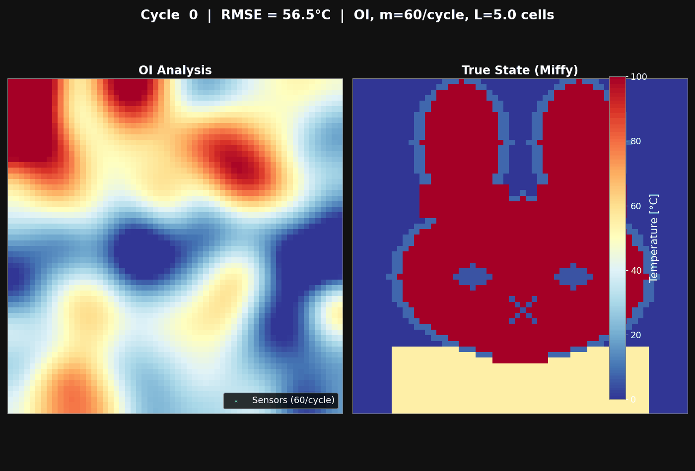
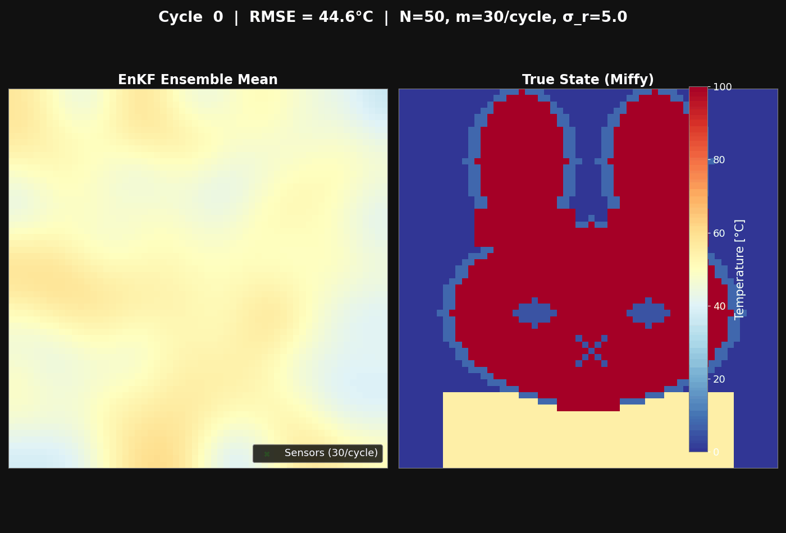
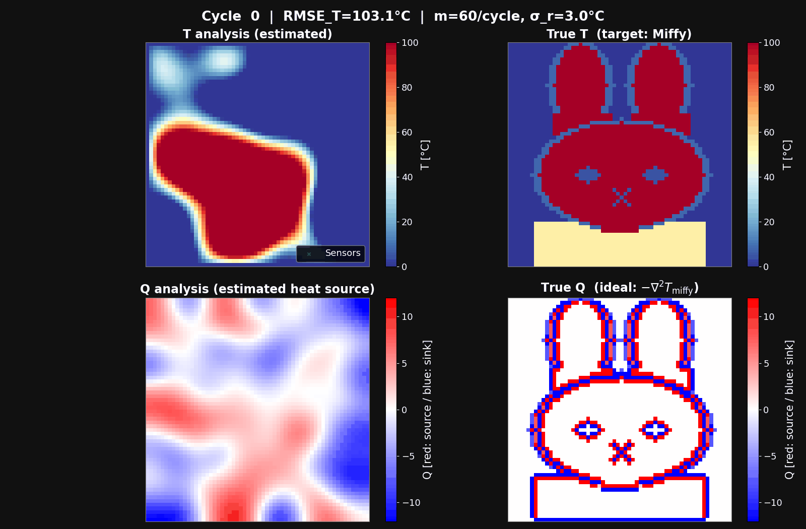
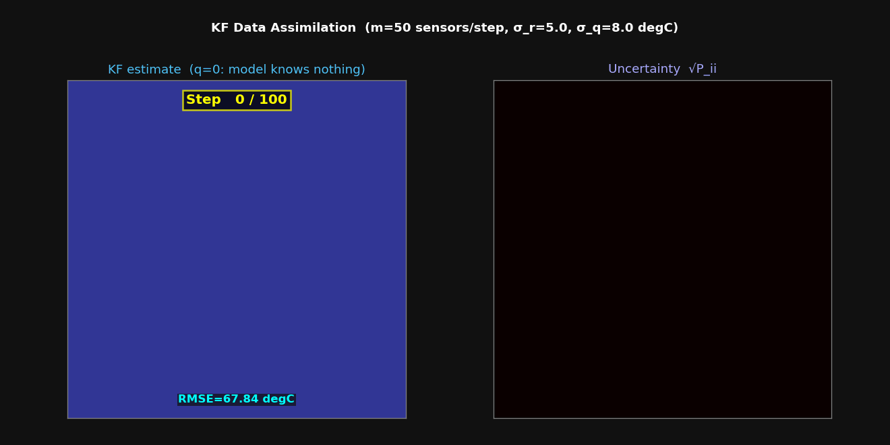
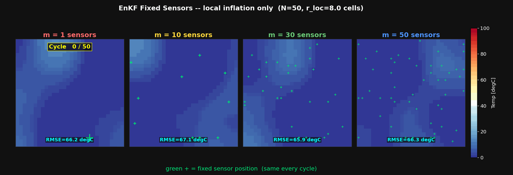
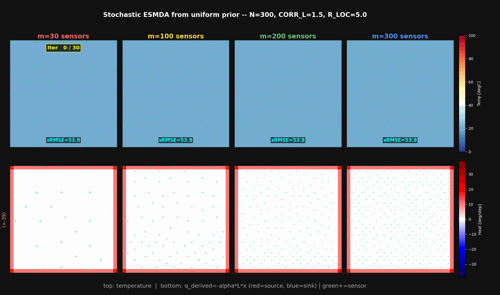
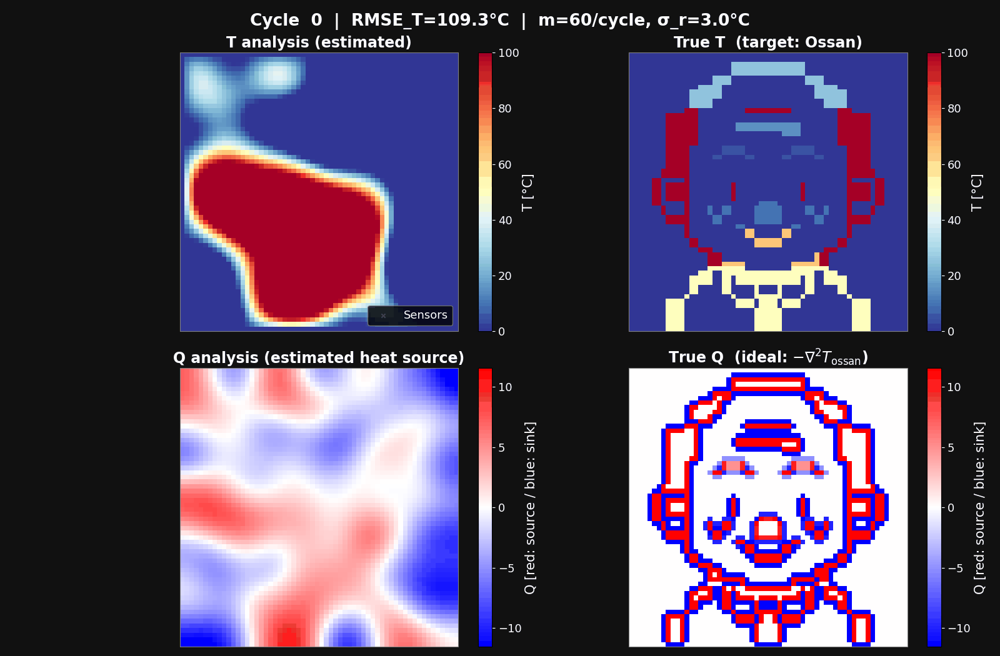

# データ同化デモ 全体サマリー

> **場所：** `practice/`  
> **対象：** ミッフィー / おっさん の温度場・熱源場同定  
> **更新：** 2026-06-14

> **引き継ぎ用：** [HANDOFF_miffy_esmda.md](HANDOFF_miffy_esmda.md)

---

## フォルダ命名規則

```
A{連番}_{対象}_{手法}_{SCセンサ配置}_{同定対象}
```

| 記号 | 意味 |
|------|------|
| `oi` / `enkf` / `kf` / `esmda` | 同化手法 |
| `SCrandomTime` | センサ位置をランダムに選び、**毎サイクル再抽選** |
| `SCrandomTimefix` | センサ位置をランダムに**一度だけ**選び、以降固定 |
| `SCfixTimefix` | センサ位置をユーザーが**手動指定**し固定 |
| `T` | 温度場を同定 |
| `Q` | 熱源場を同定（または逆算） |

---

## 全デモ一覧

### A02_miffy_oi_SCrandomTime_T
**OI（最適内挿法）× ランダムセンサ（毎回再抽選）× 温度場**



| 項目 | 内容 |
|------|------|
| 手法 | OI (Optimal Interpolation) — 解析的ガウスB行列 |
| グリッド | 40×60 = 2400 セル |
| 状態変数 | 温度 T |
| センサ | m=60 / サイクル、毎サイクルランダム再配置 |
| 初期分布 | ガウスノイズ（空間相関あり）、50°C 中心 |
| サイクル数 | N_CYC=50 |
| パラメータ | σ_r=5°C、L=8 cells（相関長）、σ_b 減衰スケジュール |

**良かった点**
- B行列が解析的なのでアンサンブル不要・高速
- 安定収束、ミッフィーが滑らかに浮かび上がる
- シンプルで教育的

**課題・改善点**
- B行列が固定のガウス型 → 実際の空間構造を学習できない
- σ_b を手動スケジュールで下げる必要あり（自動調整不可）
- 精度の天井が EnKF より低い（後半サイクルで差が出る）

**改善策**
- σ_b スケジュールを適応的にする（観測誤差と一致する収束基準）
- OI 反復回数・センサ数を増やすと精度向上

---

### A02_miffy_enkf_SCrandomTime_T
**EnKF × ランダムセンサ（毎回再抽選）× 温度場**



| 項目 | 内容 |
|------|------|
| 手法 | 確率的 EnKF（摂動観測方式） |
| グリッド | 60×60 = 3600 セル |
| 状態変数 | 温度 T |
| センサ | m=30 / サイクル、毎サイクルランダム再配置 |
| 初期分布 | 空間相関ノイズ（correlated random） |
| パラメータ | N=50、σ_r=5°C、INFL=1.05、R_loc=8 cells、N_CYC=50 |

**良かった点**
- アンサンブルB行列がデータドリブンで逐次更新される
- OI より後半サイクルの精度が高い
- ランダムセンサにより、偏ったカルマン更新が平均化される

**課題・改善点**
- ランダムセンサは「固定センサを擬似的に均等配置」する工夫
  → 実際のセンサ設置では毎回移動できない
- N=50 だとサンプリングノイズが残る

**改善策**
- N=100〜200 に増やす → 共分散精度向上
- ETKF（確率的摂動なし）に切替 → ランク崩れを防ぐ

---

### A02_miffy_enkf_SCrandomTime_Q
**EnKF（順問題付き）× ランダムセンサ × 熱源場**



| 項目 | 内容 |
|------|------|
| 手法 | 確率的 EnKF ＋ 順問題（T = L⁻¹Q を毎ステップ計算） |
| グリッド | 30×30 = 900 セル |
| 状態変数 | Q（熱源場） |
| 観測 | T（温度センサ）→ Q を間接同定 |
| センサ | m=60 / サイクル、内部セルのみランダム |
| パラメータ | N=50、σ_r=5°C、INFL=1.05、R_loc=8 cells、N_CYC=50 |

**良かった点**
- Q（熱源分布）を直接推定できる
- 温度境界（ミッフィーの輪郭）に発熱・吸熱が集中する物理的正解を再現

**課題・改善点**
- 毎ステップ spsolve（疎行列解法）を N 回呼ぶため遅い
- Q の推定は T 観測の逆問題 → 誤差伝播が大きい
- ランダムセンサ前提なので、固定センサでは発散するリスクあり

**改善策**
- Ψ = L⁻¹（900×900）を事前計算してループ内は行列積のみに変更 → 10〜20 倍高速化
- ESMDA に切替 → 固定センサでも安定（→ `A02_miffy_esmda_SCfixTimefix_Q` 参照）

---

### A02_miffy_kf_SCrandomTime_T
**線形カルマンフィルタ（熱伝導ダイナミクス）× ランダムセンサ × 温度場**



| 項目 | 内容 |
|------|------|
| 手法 | 線形 KF（Kalman Filter）— P 行列 n×n を厳密計算 |
| グリッド | 30×30 = 900 セル（メインデモは 60×60）|
| 状態変数 | 温度 T（時間発展） |
| 予測ステップ | x_{t+1} = (I + dt·α·L) x_t + プロセスノイズ |
| センサ | m=50 / ステップ、ランダム |
| パラメータ | σ_r=5°C、σ_q=8°C（プロセスノイズ）、N_STEPS=100 |

**良かった点**
- 線形 KF は厳密最適（全 P 行列を計算）
- 熱伝導方程式を予測ステップに組み込む = 物理則で状態を伝播
- DA 停止実験（`kf_da_off.py`）でセンサの有無の差が明確に示せる

**課題・改善点**
- P 行列は n×n = 900×900 → 大規模グリッドでは計算不可
- 熱伝導が長く続くと「ミッフィーが溶ける」（拡散で均一温度に近づく）
- 静的真値（静的 Miffy）に動的モデルを当てると予測が外れ続ける

**改善策**
- 時間発展する実際の熱伝導問題（初期 Miffy が拡散していくシナリオ）に使うと物理的に意味が出る
- 大規模化には EnKF（アンサンブルで P を近似）への移行が必要

---

### A02_miffy_enkf_SCrandomTimefix_T
**EnKF × ランダム固定センサ（一度抽選、以降固定）× 温度場**



| 項目 | 内容 |
|------|------|
| 手法 | 確率的 EnKF ＋ 局所インフレーション（センサ近傍のみ） |
| グリッド | 30×30 = 900 セル |
| 状態変数 | 温度 T |
| センサ | m=[1,10,30,50] 一度だけランダム抽選、以降固定 |
| 初期分布 | 空間相関ノイズ（零平均） |
| パラメータ | N=50、σ_r=5°C、INFL=1.10、R_loc=8 cells、N_CYC=50 |

**良かった点**
- 固定センサの影響（数・位置）を比較できる
- 局所インフレーション設計を試行

**課題（既知の問題）⚠️**
- **サイクル 40 以降にすべての m で発散** (RMSE: m=30 で 63°C → 137°C)
- 根本原因：インフレーション（1.10）がセンサ周辺の交差共分散を 1.10² = 1.21 倍 / サイクルで増幅
  → 50 サイクルで 1.21⁵⁰ ≈ 12,100 倍 → カルマンゲインが暴走 → 観測ノイズのランダムウォーク累積
- センサから遠いセルの xmax が 7000°C 超に達する（センサ自体は安定 spread ≈ 2°C）

**改善策**
1. ESMDA に切替 → 膨張 R が安定を保証（→ `A02_miffy_esmda_SCfixTimefix_Q` 参照）
2. N_CYC を 30 以下に制限（安定域で停止）
3. INFL を 1.0〜1.02 まで下げる（ランダムウォーク抑制）
4. 加法インフレーション（周期的に事前ノイズを追加）に変更

---

### A02_miffy_esmda_SCfixTimefix_Q  ← **現セッションのメイン**
**ESMDA × 空間充填固定センサ × 温度場復元（熱量は温度から導出）**




| 項目 | 内容 |
|------|------|
| 手法 | ESMDA (Ensemble Smoother with Multiple Data Assimilation) |
| グリッド | 30×30 = 900 セル |
| 状態変数 | T（温度）。熱量は `q = -α·L·x` で最終温度場から導出 |
| センサ | m=[30,100,200,300]。真値を使わない空間充填配置で固定 |
| 初期分布 | 全セル20°Cの一様平均 + 空間相関ノイズ（SIGMA_B=40°C） |
| パラメータ | N=300、σ_r=3°C、σ_r_eff=16.4°C（= σ_r×√30）、CORR_L=1.5、R_loc=5、N_ITER=30 |

**ESMDA の原理（なぜ安定か）**
```
標準 EnKF:  R を σ_r² で N_CYC 回更新 → 累積更新でコバリアンスが増幅発散
ESMDA:     R_eff = N_ITER × σ_r² で N_ITER 回更新 → 1 ステップ更新量が小さく安定
           N_ITER 回の ESMDA = 1 回の OI（同一事後分布）が理論的に保証
           参考: Emerick & Reynolds 2013
```

**代表ケースの結果**

| m センサ数 | 最終 RMSE |
|-----------:|----------:|
| 30 | 40.50°C |
| 100 | 26.30°C |
| 200 | 22.87°C |
| 300 | **19.82°C** |

**良かった点**
- 全 N_ITER 期間 RMSE が発散しない（インフレーション不要）
- センサを増やすほどきれいに改善（単調収束）
- 一様な初期平均から、固定点の温度観測だけで温度場を復元
- センサ配置の決定にミッフィー真値を使っていない
- センサ数10〜400点を各3シードで比較し、必要数の目安を定量化

**課題**
- 900セルの任意温度場に対して、少数の固定観測だけでは問題が不定
- 300点から400点ではRMSEが19.82°Cから19.78°Cにしか改善しない
- 現状は温度場を同化し、熱量を事後的に導出しているため、熱源の直接同定ではない

**改善策**
1. 状態変数を Q_full（全格子の熱源）に変更し、L⁻¹順問題を組み込む
2. 初期アンサンブルの相関モデルを改善し、鋭い温度境界を表現する
3. センサ設置不能領域を含む現実的な配置制約で再評価する
4. アンサンブル数・局所化半径・相関長の感度解析を行う

---

### A03_ossan_enkf_SCrandomTime_Q
**EnKF（順問題付き）× ランダムセンサ × 熱源場（おっさん）**



| 項目 | 内容 |
|------|------|
| 手法 | 確率的 EnKF ＋ 順問題（T = L⁻¹Q） |
| 対象 | おっさん（ミッフィーとは異なるグラデーション温度場） |
| グリッド | 30×30 = 900 セル |
| 状態変数 | Q（熱源場） |
| センサ | m=60 / サイクル、内部セルのみランダム |
| パラメータ | N=50、σ_r=5°C、INFL=1.05、R_loc=8、N_CYC=50 |

**良かった点**
- ミッフィー（2値的な温度場）と比較して、グラデーションのある Q 分布の同定が可能
- ミッフィーと同じ手法をおっさんに適用 → 汎用性を確認

**課題・改善策**
- ミッフィーと同様。ESMDA + 固定センサに移行すれば安定性が向上

---

## 手法比較まとめ

| フォルダ | 手法 | センサ | 状態 | 安定性 | 精度（最良） | 特徴 |
|---------|------|--------|------|--------|------------|------|
| `A02_miffy_oi_SCrandomTime_T` | OI | random/毎回 | T | ○ | 中 | 解析B、高速、シンプル |
| `A02_miffy_enkf_SCrandomTime_T` | EnKF | random/毎回 | T | ○ | 中〜高 | データドリブンB、後半◎ |
| `A02_miffy_enkf_SCrandomTime_Q` | EnKF+PDE | random/毎回 | Q | ○ | 中 | 熱源直接同定、遅い |
| `A02_miffy_kf_SCrandomTime_T` | KF(dynamics) | random/毎回 | T | ○ | 中 | 線形厳密、動的前進 |
| `A02_miffy_enkf_SCrandomTimefix_T` | EnKF+局所Infl | random/固定 | T | **×発散** | — | 固定センサでInflが暴走 |
| `A02_miffy_esmda_SCfixTimefix_Q` | ESMDA | 空間充填/固定 | T→Q | **◎安定** | **19.82°C(m=300)** | 一様初期場、センサ数を定量評価 |
| `A03_ossan_enkf_SCrandomTime_Q` | EnKF+PDE | random/毎回 | Q | ○ | 中 | おっさん熱源同定 |

---

## 発散しやすい条件（lessons learned）

```
【危険な組み合わせ】
  固定センサ × 乗法インフレーション(INFL > 1.0) × 多サイクル(N_CYC > 40)
  → センサ周辺の共分散が 1.21^(N_CYC) 倍に増幅 → カルマンゲイン暴走

【安全な組み合わせ】
  固定センサ × ESMDA(R_eff = N_ITER × R) → 更新量を制限して安定
  ランダムセンサ × EnKF(INFL ≈ 1.05) → 偏りが平均化されて安定

【白色ノイズ初期アンサンブルの危険】
  白色ノイズ → 偽の長距離相関 → K_loc が大きなランダム更新 → 発散
  ガウスフィルタ相関ノイズ(CORR_L=5) を使うこと
```

---

## 今後の推奨実験

1. **ESMDA + 固定センサ + 状態=Q_full**  
   `A02_miffy_esmda_SCfixTimefix_Q` の状態変数を Q（全格子）に変更し、
   L⁻¹ 順問題を組み込む → 熱源の完全逆問題として解く

2. **センサ最適化（OED）**  
   不確実性（アンサンブル分散）が最大のセルにセンサを動的配置 → 情報量最大化

3. **高解像度化（60×60）**  
   ミッフィーの細部（目・口・耳）をより精細に再現

4. **おっさん版 ESMDA**  
   `A03_ossan_enkf_SCrandomTime_Q` → `A03_ossan_esmda_SCfixTimefix_Q` に移行

---

## アウトプットファイル対応

各フォルダの `img/` ディレクトリに以下が生成される：

| ファイル名パターン | 内容 |
|----------------|------|
| `anim_*.gif` | 同化プロセスのアニメーション（メイン成果物）|
| `fig00_sensor_layout.png` | センサ配置図 |
| `fig01_rmse.png` | RMSE 収束曲線 |
| `fig02_*_final.png` | 最終推定状態 |
| `fig03_*_final.png` | 最終推定 q / 比較図 |
